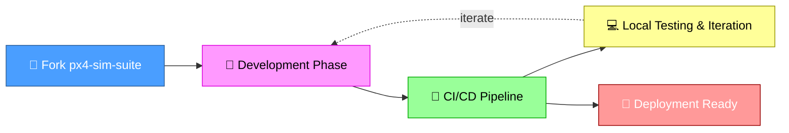
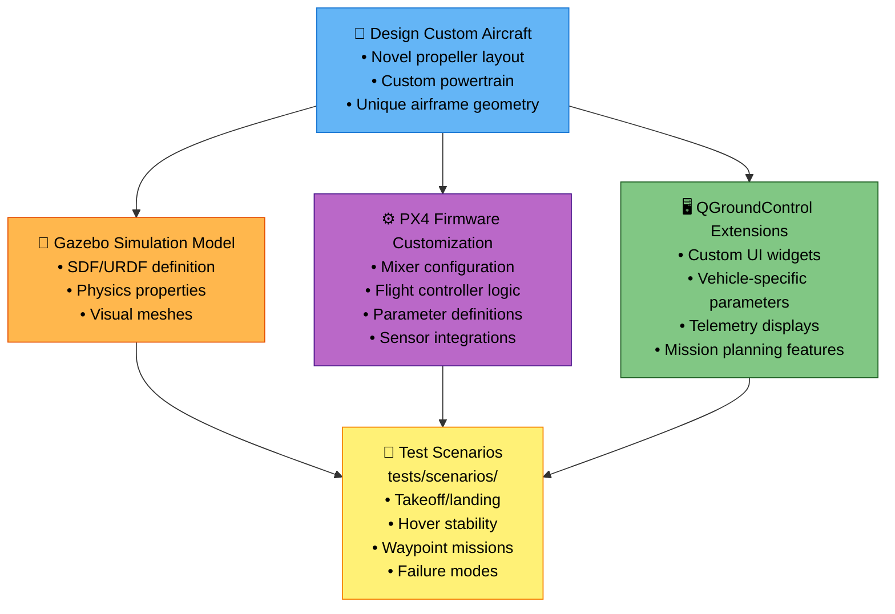
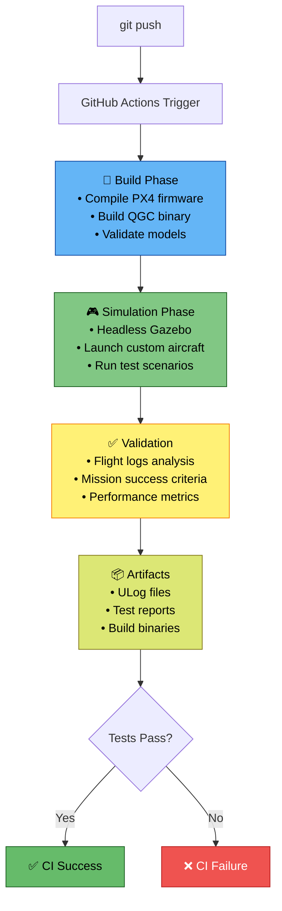
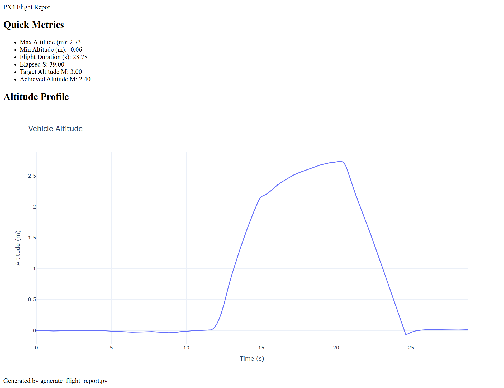
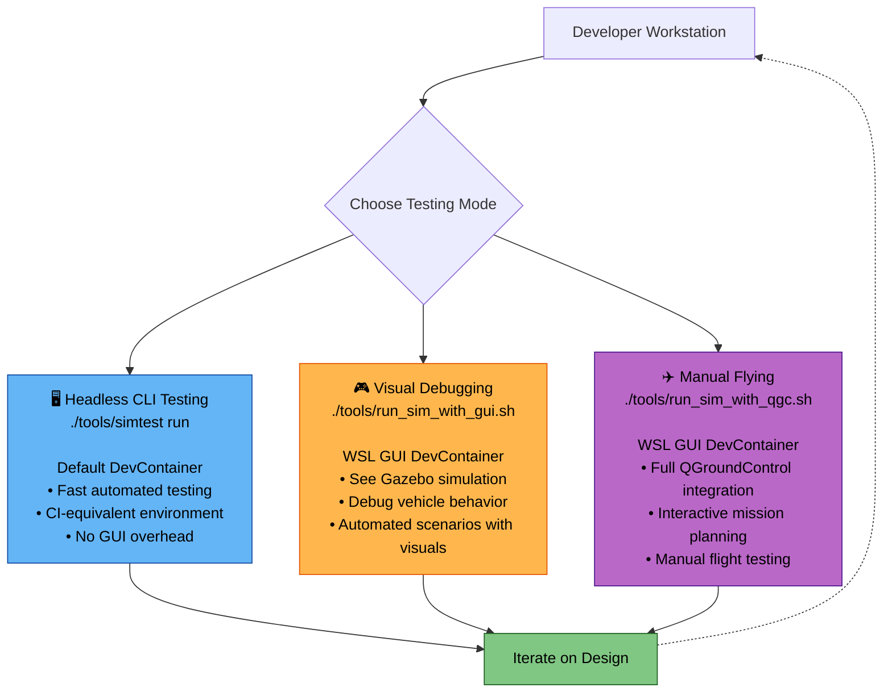
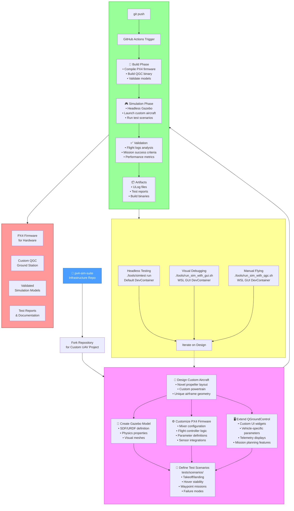

# px4-sim-suite

An **example infrastructure repository** for developing custom UAVs with **simulated mission-based CI/CD**.

This repository demonstrates how to:
- Develop custom aircraft models (novel propeller configurations, powertrains, etc.)
- Create custom PX4 firmware support for new vehicle types
- Extend QGroundControl with custom GUI integrations
- Test everything through **automated mission scenarios** in simulation
- Maintain **software CI/CD across the entire development stack**

**Key Capabilities:**

- **Infrastructure as Code**: Container-based development environments (DevContainers) with dependency management
- **Simulation First**: Test flight behavior before hardware exists
- **Mission-Based Testing**: Define scenarios as code (`tests/scenarios/`), validate automatically
- **Hybrid Workflows**: CLI for automation, GUI for visual debugging and manual control
- **Full Stack Integration**: From firmware to ground station, tested together
- **Continuous Validation**: Every code change triggers automated flight tests

### Quick Demo

GUI running in devcontainer: (30-second time-lapse):

https://github.com/user-attachments/assets/794316d0-8449-4fe8-acc7-1faaeac2737a

---

## Development Workflow

### Workflow Diagrams

The following diagrams break down the custom UAV development lifecycle into focused views suitable for presentation:

#### 1. High-Level Workflow Overview

This diagram shows the main phases of the development lifecycle:



#### 2. Development Phase Detail

This diagram shows the parallel development streams for custom UAV projects:



#### 3. CI/CD Pipeline

This diagram shows the automated testing pipeline that runs on every commit:



**CI/CD Artifacts Example:**

The pipeline generates detailed flight reports showing mission performance and telemetry data:



*Example HTML flight report generated by GitHub Actions CI showing altitude, velocity, and mission event timeline*

#### 4. Local Development Workflows

This diagram shows the different modes for local testing and debugging:



### Complete Development Workflow

This comprehensive diagram illustrates the complete custom UAV development lifecycle enabled by this infrastructure:



---

## What This Repository Provides

This is an **orchestration and integration layer** that wraps PX4, Gazebo, and QGroundControl to enable:

- Portable, container-friendly execution model
- Mission-level scenario testing as a first-class concept
- Artifact contracts (logs, reports) suitable for CI
- Clear separation between "engine" and "product/system testing"
- Agentic-AI-friendly contribution boundaries
- Hybrid human + agentic AI development workflows
- Portability across Ubuntu 24.04, WSL2, GitHub Codespaces, and headless CI

**This repository is not a fork of PX4.**
It treats PX4, QGC, and Gazebo models as submodules, allowing you to customize them while maintaining upstream compatibility.

---

## Repository structure (high-level)

```text
px4-sim-suite/
├── px4/                 # PX4-Autopilot (fork, submodule)
├── qgroundcontrol/      # QGroundControl (fork, submodule)
├── px4-gazebo-models/   # Gazebo models (fork or upstream, submodule)
├── tools/               # Orchestration, runners, CI glue (owned here)
├── tests/               # Scenario / mission definitions (owned here)
├── docs/                # Design notes, references
├── AGENTS.md            # Rules and procedures for agentic AI
└── README.md
```

The **`px4/` directory already contains extensive simulation infrastructure** (Gazebo, FlightGear, jMAVSim, etc.) via PX4’s own submodules.
This repo intentionally **does not duplicate that functionality**, and instead layers testing, automation, and workflow management *around* PX4.

---

## Design intent

PX4 already functions as a **self-contained firmware + simulation engine**.
However, PX4 alone does **not** provide:

* A portable, container-friendly execution model
* Mission-level scenario testing as a first-class concept
* Artifact contracts (logs, reports) suitable for CI
* Clear separation between “engine” and “product/system testing”
* Agentic-AI-friendly contribution boundaries

This repository exists to fill those gaps **without modifying PX4’s internal structure unless necessary**.

Key architectural principle:

> **PX4 is treated as a vendor engine.
> This repository owns orchestration, scenarios, CI, and workflow.**

---

## Submodules and forks (overview)

This repository uses **git submodules** for large upstream projects that we intentionally fork and track:

| Component         | Location             | Ownership                     |
| ----------------- | -------------------- | ----------------------------- |
| PX4 Autopilot     | `px4/`               | Fork maintained by repo owner |
| QGroundControl    | `qgroundcontrol/`    | Fork maintained by repo owner |
| PX4 Gazebo Models | `px4-gazebo-models/` | Fork or upstream mirror       |

Each fork has:

* an `origin` remote (our fork)
* an `upstream` remote (canonical project)

Upstream merges are intentional and explicit.

See **`AGENTS.md`** for the exact rules governing submodules and how changes are proposed and applied.

---

## Human vs agent responsibilities

This is a **hybrid-managed repository**:

* Humans:

	* Own repo structure
	* Own submodule configuration
	* Perform upstream merges
	* Apply cross-repo changes
* Agentic AI (Codex, Copilot, etc.):

	* Propose changes
	* Modify code in-place where allowed
	* Leave structured instructions or patches when blocked by permissions

This division is intentional and documented in `AGENTS.md`.

---

## Important upstream sources (context)

These projects provide the underlying capabilities used here:

* PX4 Autopilot: [https://github.com/PX4/PX4-Autopilot](https://github.com/PX4/PX4-Autopilot)
* PX4 Simulation docs: [https://docs.px4.io/main/en/simulation/](https://docs.px4.io/main/en/simulation/)
* PX4 Gazebo models: [https://github.com/PX4/PX4-gazebo-models](https://github.com/PX4/PX4-gazebo-models)
* QGroundControl: [https://github.com/mavlink/qgroundcontrol](https://github.com/mavlink/qgroundcontrol)
* MAVLink: [https://github.com/mavlink/mavlink](https://github.com/mavlink/mavlink)

PX4 already vendors many simulation components internally via submodules; this repo does **not** attempt to replace that system.

---

## Scope boundaries (important)

This repository:

* ✔ Wraps PX4 for testing and automation
* ✔ Supports Gazebo-based simulation
* ✔ Supports human-in-the-loop and headless execution
* ✔ Supports agent-assisted development

This repository does **not**:

* ❌ Replace PX4’s internal simulation system
* ❌ Vendor PX4 dependencies manually
* ❌ Treat QGroundControl as a CI dependency
* ❌ Assume a single-developer workflow

---

## For agents and automation systems

If you are an automated agent or a human working with one:

👉 **Read `AGENTS.md` before making changes.**

That file defines:

* What can and cannot be modified directly
* How submodule changes are proposed
* How permissions and limitations are handled
* How work is handed off between agents and humans

---

## Stage 1 (MVP) quick start

Looking to bring up PX4 SITL on Ubuntu 24.04/WSL2 for the MVP? Follow the runbook in `docs/stage1-sitl.md` for dependency setup, headless launch, and a manual takeoff/land smoke test.

---

## Stage 1 CLI entry point (`tools/simtest`)

The unified CLI entry point for the simulation pipeline is provided as a Stage 1 stub at `tools/simtest`.
It is POSIX-shell-friendly and intended to run the same way on Ubuntu, WSL2, GitHub Actions, Codespaces, or a mounted Docker workspace.

```
Usage: simtest [build|run|collect|all|--help]
  build     Build PX4, models, dependencies
  run       Run the Gazebo simulation
  collect   Fetch artifacts (logs, flight results)
  all       Execute build + run + collect
```

### `build` command (Stage 2)

The `build` subcommand now runs the PX4 SITL CMake flow for Gazebo Classic (non-ROS) targeting the default quadrotor airframe:

* Executes CMake from within `px4/` and configures `build/px4_sitl_default`
* Uses the Unix Makefiles generator with `make -j$(nproc)`
* Expects `cmake` and `make` to be installed; otherwise exits with a clear error

Troubleshooting tips:

* Ensure the `px4/` submodule is present (run `git submodule update --init --recursive` if needed)
* Install `cmake` and `make` via your system package manager before running `simtest build`

Examples:

```
sh tools/simtest build
sh tools/simtest all
```

### `run` command (Stage 4)

The `run` subcommand now launches a **headless** PX4 SITL + Gazebo Harmonic session using the built firmware:

* Ensures the PX4 build exists (invokes `build` automatically if missing)
* Uses the modern Gazebo Harmonic (`gz` CLI) flow, invoking `make px4_sitl gz_<model>` from `px4/`
* Defaults to the `x500` quadrotor (override with `PX4_SIM_MODEL`) and extends `PX4_GZ_MODEL_PATH`/`GZ_SIM_RESOURCE_PATH` with `px4-gazebo-models`
* Runs for a bounded duration (`SIM_DURATION` seconds; defaults to 45) before shutting down
* Executes the default Stage 5 scenario (`tests/scenarios/takeoff_land.py`) that arms, climbs to ~3 m, holds briefly, and lands via MAVLink commands

You can customize the duration or model:

```sh
SIM_DURATION=30 PX4_SIM_MODEL=x500 sh tools/simtest run
```

Use `sh tools/simtest all` to run both build and simulation in sequence.

If you want to disable automated flight control (for interactive debugging or manual testing), set `SIMTEST_SCENARIO=none` before invoking `simtest run`. To plug in a different scripted mission, drop a Python helper under `tests/scenarios/` and set `SIMTEST_SCENARIO=<name>`.

Each run persists its telemetry and summary artifacts under `artifacts/` (override with `SIMTEST_ARTIFACT_DIR`):

* `takeoff_land.log` — live scenario transcript (arm, hover, land events)
* `takeoff_land_summary.json` — hover/landing metrics in JSON
* `<timestamp>.ulg` — copy of the most recent PX4 flight log for post-flight analysis

Use `sh tools/simtest collect` to list the files produced in the selected artifact directory.

The `run` flow launches a lightweight MAVLink heartbeat helper implemented with `pymavlink` so PX4 no longer reports a missing GCS on startup. The dev container installs this dependency automatically; native environments should ensure `pymavlink` is available (for example via `pip install --user pymavlink`).

### QGroundControl automation (optional)

`tools/simtest` also provides a Stage 8 scaffold for exercising QGroundControl without leaving the repo:

- `sh tools/simtest qgc build` configures QGC with `QGC_BUILD_TESTING=ON` by invoking the Qt toolchain declared in `tools/environment_manifest.json` and produces both the desktop binary and AppImage target inside `build/qgc-simtest/`.
- `sh tools/simtest qgc test` runs the CTest suite headlessly (`xvfb-run` when available, otherwise `QT_QPA_PLATFORM=offscreen`).
- `sh tools/simtest qgc stub` launches the `--simple-boot-test` flow under Xvfb (if present) and drives a small MAVLink stub defined in `tools/qgc_virtual_px4.py`; artifacts are written to `artifacts/qgc/`.
- `SIMTEST_ENABLE_QGC=1 ./tools/run_ci.sh --inside-devcontainer` (or the matching GitHub Actions variable) enables the same steps in CI, appending timing data to `artifacts/simtest-report.txt` alongside dedicated QGC logs.
	- Set `SIMTEST_QGC_SKIP_PARAM_CHECK=1` when you need the stub to succeed without a parameter request (useful for ad-hoc debugging).

## Development container and CI build flow

A VS Code-compatible dev container is defined in `.devcontainer/devcontainer.json` to provide a consistent Ubuntu 24.04 base with CMake, Make, Python tooling, and PX4’s own Ubuntu setup script preinstalled. The container automatically initializes all submodules recursively, runs PX4’s `Tools/setup/ubuntu.sh --no-nuttx` to install SITL dependencies (including the Gazebo Harmonic toolchain via the `gz` CLI), installs the `gz-harmonic` meta-package explicitly, and mounts the repository at `/workspaces/<repo>`, matching the default Dev Containers layout so commands like the update hook run in the right place. The post-create hook now installs `pymavlink` alongside the existing PX4 Python tooling so the heartbeat helper is available everywhere.

For a single cross-platform entry point, use `tools/run_ci.sh`. Without arguments it builds (or updates) the dev container using the local `devcontainer` CLI and then runs the standard build-and-run sequence inside the container. GitHub Actions calls the same script with the `--inside-devcontainer` flag so both CI and local developers share identical orchestration. The workflow publishes three artifacts for traceability:

* `artifacts/simtest-build.log` — full build output
* `artifacts/simtest-run.log` — full headless run output
* `artifacts/simtest-report.txt` — build and run timing summary (in seconds)

These artifacts help triage build and runtime regressions across platforms while keeping the single `simtest` entry point consistent locally and in CI.

---

## DevContainer Variants

This repository provides **two devcontainer configurations** to support different workflows:

### 1. Default DevContainer (`.devcontainer/devcontainer.json`)

**Purpose:** Headless CI/CD and command-line development

**Use cases:**
- GitHub Actions CI pipeline
- Headless automated testing
- Command-line development
- GitHub Codespaces (without GUI)

**Features:**
- Ubuntu 24.04 base
- All build dependencies pre-installed
- Python 3.10 with pymavlink
- PX4 Ubuntu setup (`--no-nuttx`)
- Gazebo Harmonic toolchain
- Minimal resource footprint

**Launch:**
```bash
# Opens automatically in VS Code with Dev Containers extension
code .
```

### 2. WSL GUI DevContainer (`.devcontainer/wsl-gui/devcontainer.json`)

**Purpose:** Visual simulation and manual control with QGroundControl

**Use cases:**
- Running Gazebo with visible GUI
- Manual flying with QGroundControl
- Visual debugging of flight tests
- Interactive development on Windows WSL2

**Additional features (vs default):**
- X11/Wayland forwarding for GUI support
- WSLg integration (`/mnt/wslg`, `/tmp/.X11-unix`)
- Host networking for display
- Environment variables: `DISPLAY`, `WAYLAND_DISPLAY`, `XDG_RUNTIME_DIR`, `PULSE_SERVER`

**Launch:**
```bash
# From VS Code: Select "WSL GUI" configuration
# Or manually specify the config file
code --folder-uri vscode-remote://dev-container+/path/to/repo/.devcontainer/wsl-gui/devcontainer.json
```

### Shared Components

Both devcontainers share the same installation infrastructure:

**Common:**
- Base image: `mcr.microsoft.com/devcontainers/base:ubuntu-24.04`
- Dependency manifest: `tools/environment_manifest.json`
- Installation script: `tools/env_requirements.py install`
- PX4 setup: `px4/Tools/setup/ubuntu.sh --no-nuttx`
- Submodule initialization: `git submodule update --init --recursive`

**Divergence points:**
- WSL GUI adds display mounts and environment variables
- WSL GUI uses `--net=host` for X11 forwarding
- Default has no GUI-specific configuration

### Which to Use?

| Workflow | DevContainer | Command Example |
|----------|-------------|-----------------|
| CI/CD pipeline | Default | `./tools/simtest run` |
| Headless testing | Default | `./tools/simtest run` |
| GUI + automation | WSL GUI | `./tools/run_sim_with_gui.sh` |
| QGC manual control | WSL GUI | `./tools/run_sim_with_qgc.sh` |
| Development (no GUI) | Default | Any CLI workflow |
| Development (with GUI) | WSL GUI | Any GUI workflow |

### GUI Tool Requirements

The following tools **require** the WSL GUI devcontainer:
- `./tools/run_sim_with_gui.sh` - Visual Gazebo with automated scenario
- `./tools/run_sim_with_qgc.sh` - Gazebo + QGroundControl
- `./tools/launch_qgc.sh` - QGroundControl standalone

These tools will fail in the default devcontainer with:
```
Error: cannot open display: :0
```

### Installation Consistency

Both devcontainers use the same installation flow:

```bash
# 1. Environment manifest defines dependencies
tools/environment_manifest.json

# 2. Installation script reads manifest
python3 tools/env_requirements.py install

# 3. PX4 setup script (Gazebo, MAVLink, etc.)
bash px4/Tools/setup/ubuntu.sh --no-nuttx
```

This ensures:
- No duplicate package lists
- Single source of truth for dependencies
- Consistent versions across CI and local development
- Easy updates (edit manifest, rebuild container)

