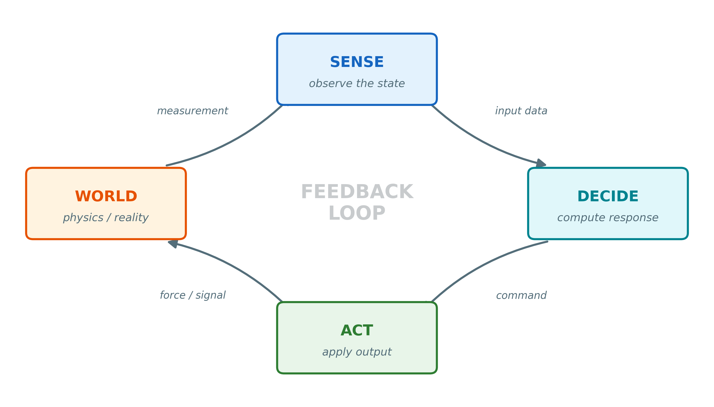
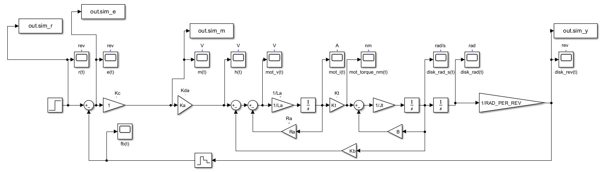
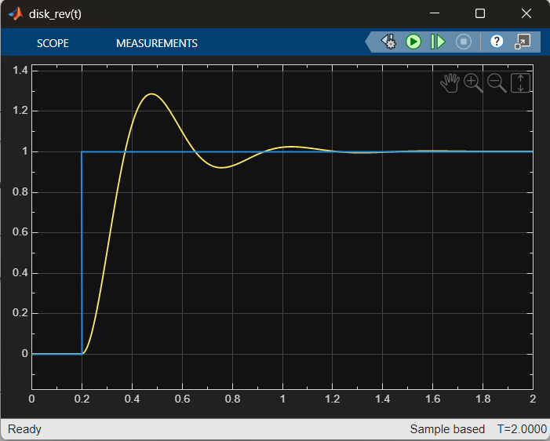
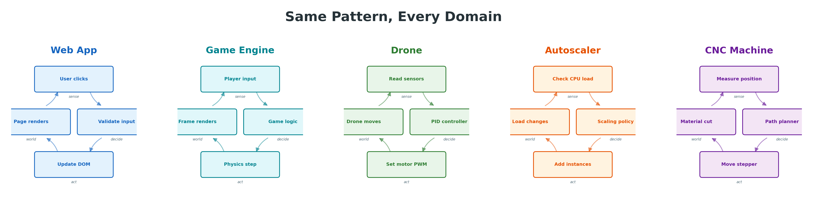
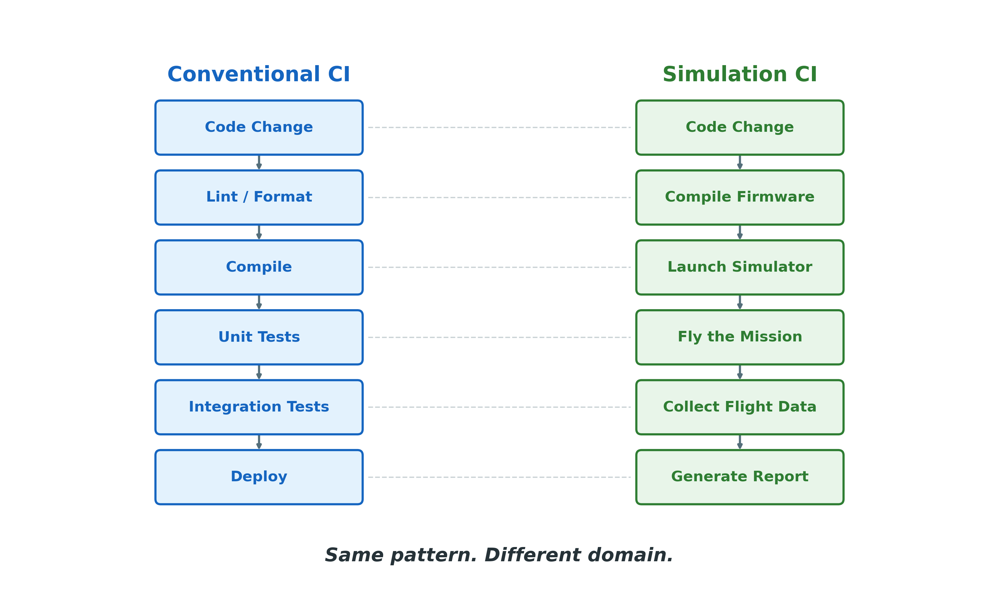
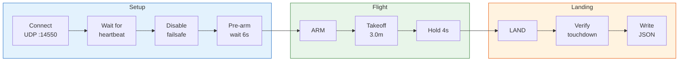
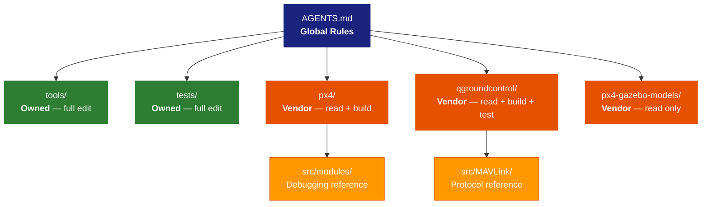
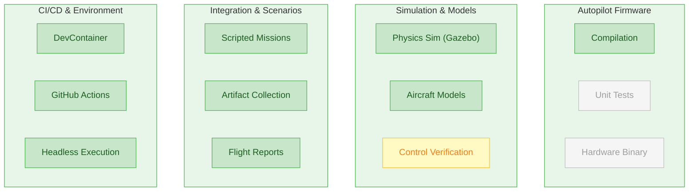
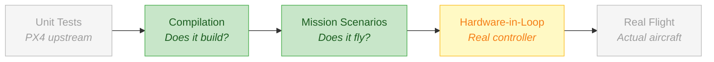

<style>
/* Tighter margins to prevent bottom clipping */
section {
  padding: 40px 60px 30px 60px;
}
section::after {
  /* page number */
  font-size: 0.6em;
}
header, footer {
  font-size: 0.55em;
}
/* Smaller code blocks globally */
pre {
  font-size: 0.85em;
}
</style>

<!-- _class: lead -->
<!-- _paginate: false -->
<!-- _header: '' -->
<!-- _footer: '' -->

# When Your CI/CD Pipeline Flies a Drone

## Feedback, Control, and Testing Things That Move

/dev/reno Meetup

<!--
TIMING: 0:00 — Title slide

"Hi everyone. I'm [name]. I build infrastructure for developing custom drones —
specifically, I work on the open-source PX4 autopilot ecosystem.

Tonight I want to talk about something that I think connects what I do
to what everyone in this room does — regardless of whether you work in
web, games, data, manufacturing, or anything else.

I want to talk about feedback loops, control, and what happens when
your CI/CD pipeline has to fly a drone."
-->

---

# What Does Your CI Pipeline Do?

<br>

```
  Code Change  →  Lint  →  Compile  →  Unit Tests  →  Deploy
```

<br>

**Mine does this:**

```
  Code Change  →  Compile Firmware  →  Launch Simulator  →  Fly a Drone  →  Land Safely
```

<br>

> My "integration test" arms a vehicle, takes off to 3 meters, hovers for 4 seconds, and lands.
> If the drone crashes, the test fails.

<!--
TIMING: 0:30

"So, quick show of hands — how many of you have a CI/CD pipeline?
Most of you, right? And what does it do? Lint, compile, run tests,
maybe deploy.

Mine compiles autopilot firmware, launches a physics simulator, and
literally flies a drone. If the drone crashes, the test fails.

That sounds exotic, but I want to show you that the underlying pattern
is something every one of you already uses."
-->

---

# Quick Context: What Am I Actually Working On?

**PX4-Sim-Suite** — an infrastructure repo for custom UAV development

- **PX4**: open-source autopilot firmware (runs on real flight controllers)
- **Gazebo**: physics simulator (gravity, aerodynamics, sensors)
- **MAVLink**: binary protocol for talking to drones (think: HTTP but for aircraft)
- **Python + pymavlink**: scripted flight scenarios

The repo wraps these as **git submodules** and adds:
orchestration, automated flight testing, CI/CD, and portable dev environments.

> I don't write the autopilot. I write the infrastructure to **test** the autopilot.

<!--
TIMING: 1:00

"Quick context on what I'm actually building. PX4 is the open-source
autopilot that runs on real Pixhawk flight controllers. Gazebo is a
physics engine — it simulates gravity, aerodynamics, sensors.
MAVLink is the communication protocol, like HTTP but for aircraft.

My repo doesn't fork any of these. It wraps them and adds
the testing, CI, and developer workflow layer on top.

Think of it like this: I don't write the autopilot. I write the
infrastructure to test the autopilot."
-->

---

<!-- _class: lead -->

# The Universal Pattern

## Every developer writes control loops

<!--
TIMING: 1:30

"OK, so before I get into the drone stuff, I want to talk about a
pattern that I think is deeply universal in software — and most
developers don't think of it this way."
-->

---

# The Feedback Loop



**Sense** the state. **Decide** what to do. **Act** on it. The **world** responds. Repeat.

<!--
TIMING: 1:45

"This is a feedback loop. Sense the state of the world. Decide what
to do about it. Act on that decision. The world responds. And you
sense again.

In control theory, this is THE fundamental concept. But here's the
thing — every developer writes these. You just don't always call them
that."
-->

---

# If You've Taken a Controls Class...



 Reference → Error → Controller → Plant → Feedback. **Same loop, formal math.**

<!--
TIMING: 2:00

"If you've ever taken a controls class — or stared into the abyss
that is Simulink — you've seen this exact pattern dressed up in
transfer functions and Laplace transforms.

The block diagram IS the feedback loop. You have a reference signal,
compute the error, run it through a controller, drive the plant,
and feed the output back. That step response on the left? That's
what 'good tuning' looks like — overshoot, settle, converge.

The point is: this isn't exotic. It's the same sense-decide-act loop,
just with more math. And every domain has its own version of it."
-->

---

# You Already Write Control Loops



<!--
TIMING: 2:15

"A web app: user clicks, you validate, update the DOM, the page renders,
and the user sees the result and clicks again. Feedback loop.

A game engine: player input, game logic, physics step, frame renders.
60 times per second. Feedback loop.

A drone: read sensors, PID controller computes, set motor PWM, the
drone moves. Hundreds of times per second. Feedback loop.

An autoscaler: check CPU load, apply scaling policy, spin up instances,
load changes. Feedback loop.

A CNC machine — like at Send Cut Send — measure tool position,
compute the next path segment, move the stepper motor, material gets
cut. Feedback loop.

Same pattern, every domain. The difference is the stakes and the
physics."
-->

---

# The Difference Is What's in the Loop

| Domain | Sense | Decide | Act | Consequence of Bug |
|--------|-------|--------|-----|-------------------|
| Web app | DOM event | Event handler | setState | Bad UX |
| Game | Player input | AI / physics | Render frame | Glitch |
| Autoscaler | CPU metrics | Policy engine | Scale fleet | Wasted $$ |
| CNC | Encoder position | Path planner | Stepper pulse | Ruined part |
| **Drone** | **IMU + GPS** | **PID controller** | **Motor thrust** | **Crash** |

When your feedback loop has a motor attached, **you can't just redeploy.**

<!--
TIMING: 3:00

"The table here shows the same four steps for each domain, but the
consequences are very different. A web app bug? Bad UX. A game bug?
A visual glitch. A drone bug? The aircraft crashes.

When your feedback loop has a motor attached, you can't just push
a fix and redeploy. That's why testing matters so much in this world."
-->

---

<!-- _class: lead -->

# The Problem

## You can't unit test flight

<!--
TIMING: 3:30

"So here's the core problem. How do you test something like this?"
-->

---

# What Does a "Test" Even Mean Here?

**Conventional testing:**

```python
def test_addition():
    assert add(2, 3) == 5  # 0.001 seconds
```

**My testing:**

```python
# 1. Connect to autopilot via MAVLink (UDP)
# 2. Arm the vehicle
# 3. Command takeoff to 3.0 meters
# 4. Wait until altitude >= 2.4m
# 5. Hold position for 4 seconds
# 6. Command landing → verify touchdown
# Total: ~45 seconds of simulated flight
```

> You can't mock gravity. Well — you can. That's what a physics simulator is.

<!--
TIMING: 3:45

"Your test asserts that a function returns the right value. Takes
a millisecond.

My test connects to an autopilot over a network protocol, arms a
vehicle, commands a takeoff, waits for it to actually reach altitude,
holds position, lands, and verifies touchdown. That takes 45 seconds
of simulated flight time.

You can't mock gravity. Well — you can. That's literally what a
physics simulator is. And that's the solution."
-->

---

# The Actual Test Script — `takeoff_land.py`

```python
# Arm the vehicle
send_command(master, heartbeat,
    MAV_CMD_COMPONENT_ARM_DISARM, (1, 0, 0, 0, 0, 0, 0))

# Command takeoff to target altitude
send_command(master, heartbeat,
    MAV_CMD_NAV_TAKEOFF, (0, 0, 0, 0, nan, nan, altitude))

# Wait for altitude (80% of target)
achieved = wait_relative_altitude(master, heartbeat,
    altitude * 0.8, lambda a, t: a >= t, timeout=60.0)

# Command landing
send_command(master, heartbeat,
    MAV_CMD_NAV_LAND, (0, 0, 0, 0, nan, nan, 0))
```

Just Python, talking over UDP, to a flight controller running in a simulator.

<!--
TIMING: 4:30

"Here's what the actual code looks like. It's just Python. pymavlink
sends MAVLink commands over UDP to the PX4 autopilot, which is running
in Software-In-The-Loop mode connected to a Gazebo physics simulator.

The scenario arms the vehicle, commands takeoff, waits until the
simulated drone actually reaches 80% of the target altitude, holds,
then lands. If any step times out or gets rejected, the test fails
with a specific exit code.

Nothing exotic about the code. The exotic part is what's on the other
end of that UDP socket: a full flight controller running against a
physics engine."
-->

---

# The Result — Not Just Pass/Fail

```json
{
  "status": "success",
  "target_altitude_m": 3.0,
  "achieved_altitude_m": 2.87,
  "landing_altitude_m": 0.12,
  "hold_duration_s": 4.0,
  "elapsed_s": 38.41
}
```

Plus a **flight log** (ULog) and an **HTML altitude plot**.

> This isn't an assertion. It's a **measurement**.

<!--
TIMING: 5:15

"And the output isn't just pass or fail. It's structured data —
target altitude, achieved altitude, landing altitude, elapsed time.
Plus a binary flight log that you can replay, and an HTML report
with an altitude profile chart.

This is closer to a scientific measurement than a unit test assertion.
You're asking 'did the controller achieve the desired behavior within
acceptable tolerances?' — not 'did the function return 5?'"
-->

---

<!-- _class: lead -->

# The CI Pipeline

## Simulation as a first-class testing strategy

<!--
TIMING: 5:30

"So how does this fit into CI/CD?"
-->

---

# What Happens When a PR Opens

```mermaid
graph LR
    PR["PR Opened"] --> DC["Spin up DevContainer"]
    DC --> BUILD["Compile PX4 Firmware"]
    BUILD --> SIM["Launch Gazebo<br/>(headless)"]
    SIM --> FLY["Run Flight Scenario"]
    FLY --> ART["Collect Artifacts"]
    ART --> RPT["Generate Report"]

    style PR fill:#e3f2fd,stroke:#1565c0,color:#0d47a1
    style DC fill:#e3f2fd,stroke:#1565c0,color:#0d47a1
    style BUILD fill:#e3f2fd,stroke:#1565c0,color:#0d47a1
    style SIM fill:#e8f5e9,stroke:#2e7d32,color:#1b5e20
    style FLY fill:#e8f5e9,stroke:#2e7d32,color:#1b5e20
    style ART fill:#fff3e0,stroke:#e65100,color:#bf360c
    style RPT fill:#fff3e0,stroke:#e65100,color:#bf360c
```



1. **Same DevContainer** as local dev — no separate CI Dockerfile
2. **PX4 compiles** inside the container (~3 min)
3. **Gazebo runs headless** — no GPU, no display (virtual framebuffer)
4. **Python scenario** flies the mission, writes structured results
5. **Artifacts uploaded** to GitHub: logs, flight report, ULog data

<!--
TIMING: 5:45

"When a PR opens, GitHub Actions spins up a DevContainer — the exact
same container config that developers use locally. No separate CI
Dockerfile.

Inside that container, PX4 firmware compiles. Then Gazebo launches
headless — no GPU, no monitor, just a physics engine running in a
virtual framebuffer. The Python scenario flies the mission. Artifacts
are collected and uploaded.

The whole thing runs on a standard GitHub Actions runner. No special
hardware."
-->

---

# The Entire CI Config

```yaml
name: simtest-build
on: pull_request
jobs:
  simtest-build:
    runs-on: ubuntu-24.04
    steps:
      - uses: actions/checkout@v4
        with: { submodules: recursive }

      - uses: devcontainers/ci@v0.3
        with:
          runCmd: ./tools/run_ci.sh --inside-devcontainer

      - uses: actions/upload-artifact@v4
        with: { name: simtest-artifacts, path: artifacts }
```

**32 lines.** The DevContainer definition does the heavy lifting.

<!--
TIMING: 6:30

"Here's the entire GitHub Actions config. 32 lines. The key insight
is that devcontainers/ci action — it reads the same devcontainer.json
you use for local dev, builds the container, and runs your script
inside it.

No 'apt-get install' in CI. No Docker-in-Docker hacks. No 'it works
on my machine' because CI literally IS your machine."
-->

---



<!--
TIMING: 7:00

"If you zoom out, the structure is the same as any CI pipeline.
Code change, compile, test, collect results.

The difference is that 'test' means 'fly a drone through a physics
simulator for 45 seconds' instead of 'assert 2+3 equals 5.'

Same pattern. Different domain."
-->

---

<!-- _class: lead -->

# What Generalizes

## Patterns that apply to everyone in this room

<!--
TIMING: 7:15

"So what can you take away from this even if you never touch a drone?"
-->

---

# Patterns Worth Stealing

**1. Environment as Code** — Your dev environment belongs in version control, not a wiki page. DevContainers: `git clone` → open in VS Code → everything works.

**2. Test at the System Boundary** — Unit tests are great, but the highest-value tests exercise the whole system. My "unit" is an entire flight.

**3. Artifact Contracts** — Define exactly what CI produces. Same paths, same formats, every time.

**4. Same Container Everywhere** — Dev, CI, staging: identical. Zero "works on my machine."

<!--
TIMING: 7:30

"Four patterns I think are worth stealing:

First, environment as code. Your dev environment should be version
controlled, not documented in a wiki. DevContainers let you go from
git clone to a working environment in one step.

Second, test at the system boundary. Unit tests are great, but the
highest-value tests exercise the whole system end to end. My unit is
an entire flight. Yours might be a full user workflow through your app.

Third, artifact contracts. Define exactly what your CI produces. Same
paths, same formats, every run. Makes downstream tooling trivial.

Fourth, same container everywhere. Dev, CI, and staging should be
identical environments. That's how you kill 'works on my machine.'"
-->

---

# Things I'd Love to Chat About

- **Testing systems that touch the physical world** — robotics, IoT, CNC, anything with a motor
- **Is simulation testing deterministic?** — floating-point nondeterminism and flaky tests
- **The sim-to-real gap** — passing in Gazebo doesn't mean it works on the real drone
- **Could this approach work for your domain?** — games, load testing, manufacturing
- **AI-assisted development** — scoped AGENTS.md files for vendor vs. owned code

<!--
TIMING: 8:30

"I want to leave plenty of time for conversation, so here are some
things I'd love to chat about. [Read through list, hit whatever
resonates with the room]

These are all genuinely open questions that I deal with, and I think
most of them have parallels in whatever domain you work in."
-->

---

<!-- _class: lead -->
<!-- _paginate: false -->

# Questions?

**Repo:** github.com/your-org/px4-sim-suite
**PX4:** px4.io | **Gazebo:** gazebosim.org | **MAVLink:** mavlink.io

<br>

Extended slides follow for deeper conversation.

<!--
TIMING: 9:00

"That's the 10-minute version. The extended slides after this go deeper
into specific topics — DevContainers, the AGENTS.md system for AI
assistants, the full UAV testing stack, and a complete walkthrough
of the scenario script. Happy to walk through any of those in
conversation.

Thank you!"
-->

---

<!-- _class: lead -->
<!-- _paginate: false -->
<!-- _header: '' -->
<!-- _footer: '' -->

# Extended Slides

## For hallway conversations and deeper dives

---

<!-- _header: '/dev/reno — Extended' -->
<!-- _footer: 'Scenario Scripting Deep Dive' -->
<!-- _class: lead -->

# Extended: The Scenario Script

## How do you automate a flight test?

<!--
"This section walks through the full takeoff_land.py scenario script,
explaining each phase and the MAVLink protocol underneath."
-->

---

# The Flight Scenario — Full Sequence



<!--
"The full sequence has 10 steps. Blue is connection setup, green is the
active flight, orange is landing and reporting. Each step has a timeout —
if anything takes too long, you get a specific exit code."
-->

---

# Heartbeats — Keeping the Connection Alive

```python
class HeartbeatMaintainer:
    def __init__(self, master, rate_hz=1.0):
        self.master = master
        self.interval = 1.0 / rate_hz
        self._next_send = 0.0
    def tick(self):
        now = time.time()
        if now >= self._next_send:
            self.master.mav.heartbeat_send(
                MAV_TYPE_GCS, MAV_AUTOPILOT_INVALID,
                0, 0, MAV_STATE_ACTIVE)
            self._next_send = now + self.interval
```

PX4 expects >= 1 Hz. Stop sending → **data link loss failsafe**. All polling loops call `tick()`.

<!--
"MAVLink requires continuous heartbeats from the ground control station.
If PX4 stops hearing from you, it assumes you've lost comms and triggers
a failsafe — which would abort our test. So every function that waits
for something also pumps heartbeats in the background."
-->

---

# Command Handling — Retries and ACKs

```python
def send_command(master, heartbeat, command, params, timeout=8.0):
    master.mav.command_long_send(
        master.target_system, master.target_component,
        command, 0, *params)
    deadline = time.time() + timeout
    while time.time() < deadline:
        heartbeat.tick()
        ack = master.recv_match(type="COMMAND_ACK", timeout=0.5)
        if ack and ack.command == command:
            if ack.result == MAV_RESULT_ACCEPTED:     return
            if ack.result == MAV_RESULT_IN_PROGRESS:  continue
            if ack.result == TEMPORARILY_REJECTED:    continue
            raise RuntimeError(f"rejected: {ack.result}")
```

Three outcomes: **accepted**, **in progress** (keep polling), or **rejected** (retry or fail).

<!--
"Every command goes through this pattern: send, then poll for an
acknowledgment. There are three responses we handle: accepted (great,
move on), in progress (keep waiting, the autopilot is still working on
it), and temporarily rejected (maybe sensors aren't ready yet, wait and
retry).

This is a lot like calling an async API with retries — the pattern is
familiar to anyone who's written a robust HTTP client."
-->

---

# Exit Codes — Structured Failure

```python
try:
    sys.exit(main())                              # 0 = success
except TimeoutError:    write_summary("timeout"); sys.exit(2)
except RuntimeError:    write_summary("failure"); sys.exit(3)
except Exception:       write_summary("error");   sys.exit(4)
```

| Exit Code | Meaning | CI sees... |
|-----------|---------|------------|
| 0 | Success | Flight completed normally |
| 2 | Timeout | Altitude never reached |
| 3 | Rejection | Arm command refused |
| 4 | Unexpected | Network error, Python crash |

CI doesn't parse logs — it checks the exit code. The JSON summary has the details.

<!--
"The exit codes are a contract with the CI system. Zero means the flight
completed. Non-zero tells you exactly what went wrong. CI doesn't need
to parse logs — it just checks the exit code. The JSON summary gives
you the details."
-->

---

<!-- _class: lead -->
<!-- _footer: 'DevContainer Deep Dive' -->

# Extended: DevContainers

## From clone to flying in one step

<!--
"This section covers the DevContainer setup — how we get a full PX4
development environment from a single git clone, and how the same
container runs in CI."
-->

---

# The Setup Problem

**PX4 development traditionally requires:**

- Ubuntu (specific version) with dozens of system packages
- Gazebo Harmonic (not Classic — easy to install the wrong one)
- Python 3.10+ with pymavlink, plotly, pyulog, etc.
- Qt 6 SDK (for QGroundControl)
- CMake, Ninja, ccache, Make
- Correct environment variables for all of the above

**On Windows?** Add WSL2, X11 forwarding, audio routing...

> "It took me 2 days to get a build environment working" — every new contributor

<!--
"The traditional PX4 setup is brutal. Ubuntu with dozens of packages,
specific Gazebo version (not the old one, the new one with the
confusing name), Python environment, Qt SDK if you want the ground
station, and a maze of environment variables.

On Windows it's worse — you need WSL2 and display forwarding just to
see the simulator window.

Every new contributor hits this wall. DevContainers solve it completely."
-->

---

# Our Answer: DevContainers

**Prerequisites on your machine:**
1. Docker Desktop installed
2. VS Code with Dev Containers extension

**Then:**

```bash
git clone --recursive https://github.com/your-org/px4-sim-suite
# Open in VS Code → "Reopen in Container"
```

One click. Everything installs. Ready to build.

---

# Two Variants, One Codebase

```
.devcontainer/
├── devcontainer.json          ← Headless (CI + CLI work)
└── wsl-gui/
    └── devcontainer.json      ← GUI (Gazebo + QGC windows)
```

**Same base image.** Same dependencies. Same `postCreateCommand`.

The GUI variant only adds **display mounts** and **environment variables**:

```json
{ "runArgs": ["--net=host"],
  "mounts": ["/tmp/.X11-unix", "/mnt/wslg"],
  "containerEnv": { "DISPLAY": ":0", "WAYLAND_DISPLAY": "wayland-0" } }
```

<!--
"We have two container configs: headless for CI and command-line work,
and GUI for when you want to see Gazebo and QGroundControl windows.

Same base, same dependencies. The GUI one just bind-mounts the WSLg
display socket and sets environment variables. Three lines of difference."
-->

---

# The Full Dev Experience


Gazebo 3D view, QGroundControl, Docker Desktop, PX4 terminal —
all running from inside a container on Windows via WSLg.

<!--
"This is what it looks like. Gazebo showing the 3D simulation,
QGroundControl showing telemetry, Docker Desktop managing the container,
and PX4 firmware output in the terminal. All running inside a container
on Windows, with GUI windows rendered through WSLg.

From the developer's perspective, it's native. They don't need to know
or care that it's containerized."
-->

---

# CI Uses the Exact Same Container

```yaml
- uses: devcontainers/ci@v0.3
  with:
    configFile: .devcontainer/devcontainer.json
    runCmd: ./tools/run_ci.sh --inside-devcontainer
```

- No separate CI Dockerfile
- No `apt-get install` in the workflow
- No version drift between dev and CI
- **devcontainers/ci** reads `devcontainer.json` and builds the same image

> "Works on my machine" becomes "works in CI" for free.

<!--
"The punchline: CI uses the exact same devcontainer.json. The
devcontainers/ci GitHub Action reads your container config, builds it,
and runs your script inside. No separate Dockerfile. No package lists
to keep in sync. If it works on your laptop, it works in CI."
-->

---

# Environment Manifest — Single Source of Truth

```json
{
  "apt_packages": ["cmake", "ninja-build", "ccache", "libgz-sim9-dev", ...],
  "pip_packages": ["pymavlink", "plotly", "pyulog", ...],
  "commands_required": ["gz", "make", "cmake", "xvfb-run"],
  "qt": { "version": "6.10.1", "modules": ["qtcharts"] }
}
```

One JSON file defines every dependency. Used by:
- `postCreateCommand` (container setup)
- GitHub Actions CI
- `env_requirements.py check` (validation)

No duplicate dependency lists. No "did you remember to update the CI config too?"

<!--
"All dependencies live in a single JSON manifest. The same file is read
by the container setup script, by CI, and by a validation script that
checks your environment. One source of truth. If you add a dependency,
it shows up everywhere automatically."
-->

---

# What This Means for Onboarding

| | Traditional | With DevContainers |
|-|------------|-------------------|
| 1 | Install Ubuntu or VM | Install Docker Desktop |
| 2 | Install 20+ packages | `git clone --recursive` |
| 3 | Install Gazebo (correct version!) | Open in VS Code |
| 4 | Install Python deps | "Reopen in Container" |
| 5 | Install Qt SDK | ***done*** |
| 6 | Configure env vars | |
| 7 | Debug why Gazebo won't start | |

From clone to `simtest build`: **one command, zero configuration.**

<!--
"Traditional PX4 onboarding is 8+ steps over 1-2 days, and step 7 is
always 'debug why Gazebo won't start because you installed the wrong
version.' With DevContainers, it's four steps and the last one is just
clicking a button. You're building firmware within minutes of cloning."
-->

---

<!-- _class: lead -->
<!-- _footer: 'AI-Assisted Development' -->

# Extended: AGENTS.md

## Giving AI assistants context about your codebase

<!--
"This section covers something more experimental — how we use scoped
markdown files to give AI coding assistants different rules for different
parts of the repo."
-->

---

# The Problem with Global AI Instructions

**.copilot-instructions / .github/copilot-instructions.md:**

- Single file at the repo root
- Same rules everywhere
- A drone firmware directory needs different rules than a test script directory
- No way to say "you can read here, but don't edit there"

**Our repo has 3 git submodules** — vendor code we consume but don't own.
A global instruction file can't express "these are vendor; those are ours."

<!--
"Most AI instruction systems give you one file at the repo root. Same
rules everywhere. But our repo has fundamentally different zones:
code we own and can freely edit, and vendor submodules that we consume
but should never modify. A flat instruction file can't express that."
-->

---

# AGENTS.md — Scoped by Directory

```
px4-sim-suite/
├── AGENTS.md                       ← Global rules + authority model
├── tools/
│   └── AGENTS.md                   ← "Full edit access"
├── tests/
│   └── AGENTS.md                   ← "Full edit, follow test patterns"
├── px4/                            ← VENDOR SUBMODULE
│   ├── AGENTS.md                   ← "Read + build only. Do NOT commit."
│   └── src/modules/
│       └── AGENTS.md               ← "Module reference for debugging"
├── qgroundcontrol/                 ← VENDOR SUBMODULE
│   └── AGENTS.md                   ← "Read + build + test. Do NOT modify."
└── px4-gazebo-models/              ← VENDOR SUBMODULE
    └── AGENTS.md                   ← "Read only. Reference models."
```

Rules **narrow** as you go deeper — they never widen.

<!--
"AGENTS.md files are scoped to directories. The root file defines global
rules. Each subdirectory can add constraints. Vendor submodules get
'read only' or 'read and build' permissions. Our own code gets 'full
edit.'

The AI assistant's behavior changes based on WHERE it's working in the
repo — without any prompt engineering from the developer."
-->

---

# How Context Inheritance Works



Green = our code (full edit) | Orange = vendor code (restricted)

<!--
"The inheritance model is simple: each file inherits from its parent
directory and adds constraints. Green nodes are code we own — AI can
freely edit. Orange nodes are vendor submodules — AI can read and build
but should never commit changes.

This means an AI working in tools/ knows it can refactor freely, while
an AI working in px4/ knows to only read and suggest patches."
-->

---

# Same Repo, Different Behavior

**AI working in `tools/`:**
> "Full edit access. Here are the scripts and patterns. Modify freely."

**AI working in `px4/`:**
> "This is vendor code. You may read and build. Do not commit changes.
> Propose changes via patch files."

**AI working in `qgroundcontrol/`:**
> "This is vendor code. You may build and run tests.
> Do not modify source."

Behavior **changes based on working directory** — no prompt engineering needed.

<!--
"In practice, this means you can tell an AI assistant 'fix the build'
and it will know that in tools/ it should edit files directly, but in
px4/ it should only read code and suggest changes. No special prompting
required — the context comes from the directory structure itself."
-->

---

<!-- _class: lead -->
<!-- _footer: 'UAV Stack Coverage' -->

# Extended: Where We Fit

## The UAV Development and Testing Stack

<!--
"This section maps out the full UAV software development stack and shows
which parts our infrastructure covers."
-->

---

# The Full UAV Dev Stack



**Green** = covered | **Yellow** = partial | **Gray** = not covered (hardware, out of scope)

<!--
"Here's the full UAV development stack. Green boxes are what our repo
covers end-to-end. We compile firmware, run physics simulation with
Gazebo models, execute scripted flight missions, collect artifacts,
and do all of this in DevContainers via GitHub Actions.

Yellow is partial coverage — we can verify control behavior in simulation
but not with the rigor of formal verification.

Gray is out of scope — unit tests for the PX4 firmware itself (that's
upstream's job), and hardware binaries (we only do SITL, not real
flight controller builds)."
-->

---

# The UAV Testing Pyramid



We live in the **middle**: compilation + simulation.
Gray = upstream's job or real hardware. Green = what we automate.

<!--
"Think of it as a testing pyramid. At the base, PX4 has its own
component and unit tests — that's upstream's responsibility. We own the
middle: compilation and mission-level simulation. Above us is
hardware-in-the-loop testing with real controllers, and at the top is
actual flight testing.

Our contribution is making that middle layer automated, reproducible,
and CI-friendly. That's where the highest leverage is for catching
integration issues before they reach hardware."
-->

---

<!-- _class: lead -->
<!-- _footer: 'Architecture & Workflow' -->

# Extended: Architecture

## How the pieces fit together

---

# The Simulation Stack

```
┌──────────────────┐
│ QGroundControl   │  ← Human interface / mission planning
└────────┬─────────┘
         │ MAVLink (UDP 14550)
         ▼
┌──────────────────┐
│ PX4 SITL         │  ← Autopilot firmware (simulated)
└────────┬─────────┘
         │ Sensor/Actuator bridge
         ▼
┌──────────────────┐
│ Gazebo Harmonic  │  ← Physics simulation
└──────────────────┘
```

**In CI:** The Python scenario script replaces QGroundControl.
It sends the same MAVLink commands, programmatically.

<!--
"The simulation stack has three layers. QGroundControl at the top for
human interaction. PX4 running as Software-In-The-Loop in the middle —
same firmware code as the real hardware, just compiled for x86. And
Gazebo at the bottom simulating physics.

In CI, we replace the human with a Python script that sends the same
MAVLink commands programmatically. The autopilot can't tell the
difference."
-->

---

# Three Execution Modes

| Mode | Command | Display | Purpose |
|------|---------|---------|---------|
| **CI/CD** | `simtest run` | Headless | Automated testing |
| **Visual Debug** | `run_sim_with_gui.sh` | Gazebo GUI | Watch scenarios run |
| **Manual Flying** | `run_sim_with_qgc.sh` | QGC + Gazebo | Fly by hand |

```bash
./tools/simtest all             # Automated CI (no display)
./tools/run_sim_with_gui.sh     # Watch the drone fly your scenario
./tools/run_sim_with_qgc.sh     # Grab the controls yourself
```

Same firmware, same simulator — different levels of human involvement.

<!--
"There are three ways to run the simulation. Headless for CI — no
display, just the physics engine and the scenario script. GUI mode
where you can watch the drone fly in Gazebo's 3D view. And manual
mode where QGroundControl gives you a virtual joystick to fly yourself.

Same firmware, same physics. The only difference is how much human
is in the loop."
-->

---

# The `simtest` CLI — Single Entry Point

```bash
simtest build              # Compile PX4 SITL firmware
simtest run                # Run headless simulation + scenario
simtest collect            # Gather artifacts
simtest all                # Full pipeline (build + run + collect)

simtest qgc build          # Build QGroundControl from source
simtest qgc test           # Run QGC unit tests
simtest qgc stub           # Run QGC with virtual PX4 handshake
```

634 lines of POSIX shell. Sets up env vars, model paths, process management.
Handles cleanup on exit via `trap`. Same interface for dev, CI, and scripts.

<!--
"Everything goes through one CLI: simtest. Build, run, collect, or do
the whole pipeline. Under the hood it's 634 lines of POSIX shell that
manages process lifecycle, environment setup, model paths, and cleanup.

The key design choice: one entry point for everything. Developers use it
locally, CI calls the same commands. No separate 'CI mode' or
'dev mode' — it's the same tool."
-->

---

# Reading the Flight Report


ULog flight data → interactive HTML via Plotly. Uploaded as a CI artifact for PR review.

<!--
"Every CI run produces an HTML flight report. This is generated from the
ULog binary flight log using Plotly. You can see the altitude profile
over time, key metrics like max altitude and flight duration.

It's an interactive HTML file — you can zoom, hover for exact values.
Gets uploaded as a GitHub Actions artifact so reviewers can inspect the
actual flight behavior for any PR."
-->

---

<!-- _class: lead -->
<!-- _footer: 'Key Patterns' -->

# Extended: Patterns & Takeaways

## Design decisions that generalize

---

# Pattern: Vendor vs. Orchestration

**Separate what you control from what you consume.**

| Layer | Ownership | Location |
|-------|-----------|----------|
| PX4 firmware | Upstream (PX4 project) | git submodule |
| QGroundControl | Upstream (MAVLink project) | git submodule |
| Gazebo models | Upstream (PX4 project) | git submodule |
| Test scenarios | **Us** | `tests/` |
| CI/CD pipeline | **Us** | `.github/workflows/` |
| Orchestration CLI | **Us** | `tools/` |

Treat dependencies as vendor engines. **Own the integration layer.**

<!--
"The core architectural pattern: we don't fork PX4 or Gazebo. They're
git submodules. We own everything above them — the testing, CI,
developer workflow, and orchestration.

This generalizes to any project that wraps external dependencies. Own
the integration layer, consume the rest."
-->

---

# Pattern: Artifact Contracts

**Define exactly what CI produces. Same paths, same formats, every time.**

```
artifacts/
├── simtest-build.log                # Build output
├── simtest-run.log                  # Simulation output
├── simtest-report.txt               # Timing data
├── takeoff_land_summary.json        # Scenario metrics
├── flight_report.html               # Interactive charts
└── *.ulg                            # Raw PX4 flight logs
```

CI uploads `artifacts/` blindly — no path guessing. Downstream tools know exactly where to find results. Reports can be diffed across PRs. The contract is visible in the repo.

<!--
"Artifact contracts mean that every CI run produces the exact same set
of files at the exact same paths. The upload step doesn't need to know
what happened — it just grabs the artifacts/ directory.

This pattern is incredibly useful for any CI system. Define your
outputs up front, and everything downstream gets simpler."
-->

---

# Pattern: Test at the System Boundary

```
Your test:   add(2, 3) == 5              →  tests a function
Our test:    arm → takeoff → hover → land →  tests the whole system
```

**Unit tests** verify components in isolation.
**System boundary tests** verify the assembled system behaves correctly.

Both are valuable. But when your system has a physics engine, a network protocol, multiple interacting processes, and nondeterministic timing — the **system-level test** catches what unit tests can't.

> The integration is where bugs hide.

<!--
"Unit tests verify that individual functions return the right values.
System boundary tests verify that the assembled system behaves correctly
when all the pieces interact.

In our world, the interesting bugs are never in a single function —
they're in the interaction between the controller, the physics engine,
and the communication protocol. You only find those by running the
whole stack together.

This applies to web apps too. Your most valuable test isn't 'does the
validation function work?' — it's 'can a user complete the checkout
flow?' Those are system boundary tests."
-->

---

<!-- _class: lead -->
<!-- _paginate: false -->
<!-- _header: '' -->
<!-- _footer: '' -->

# Thanks!

## Let's keep talking

/dev/reno
