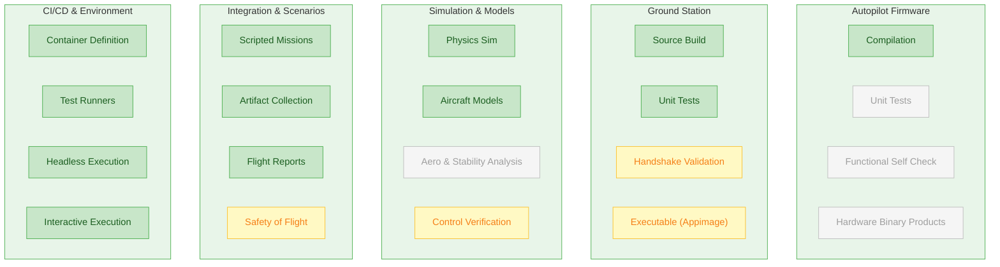
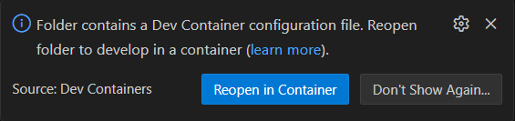
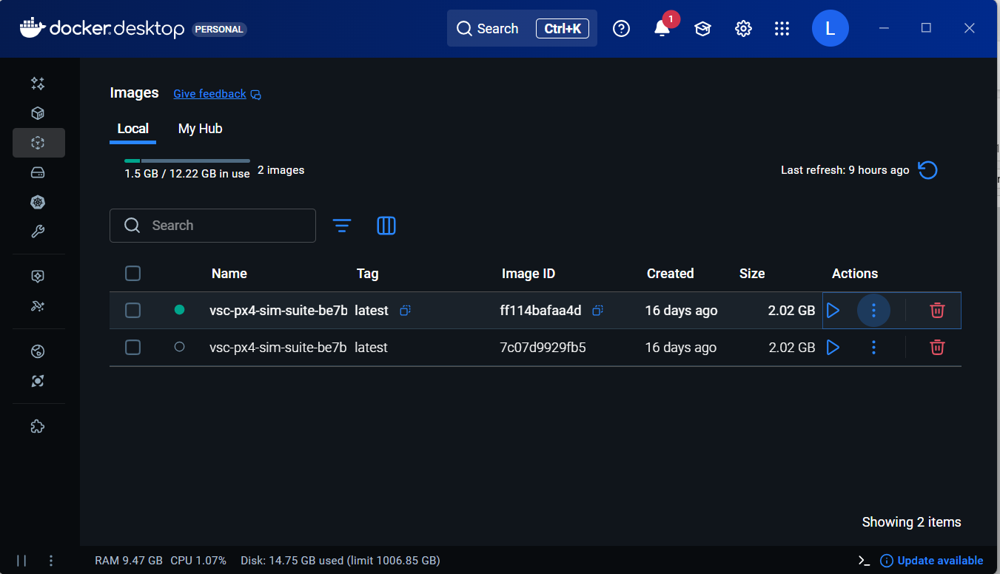
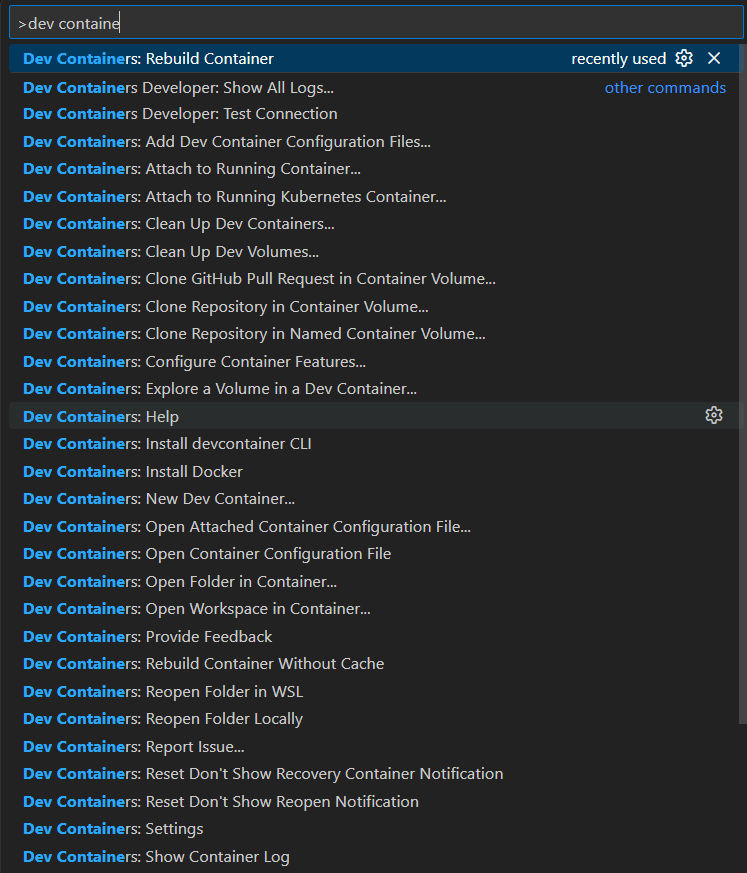
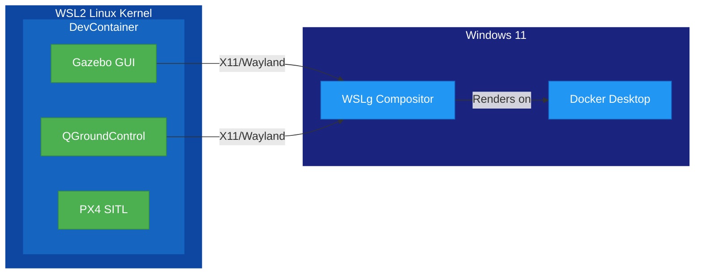
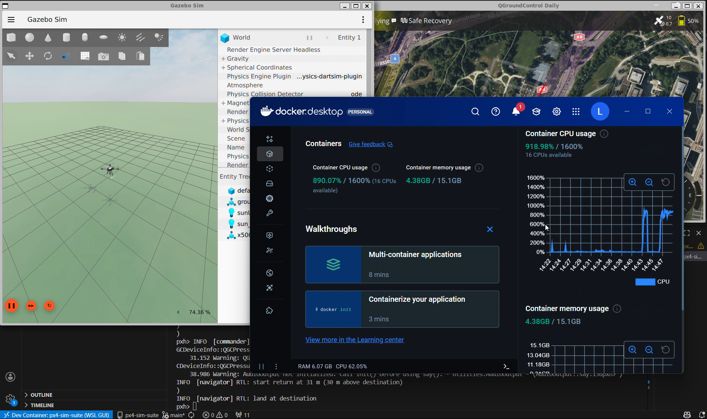
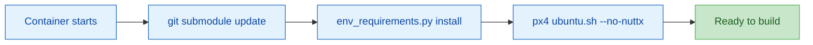
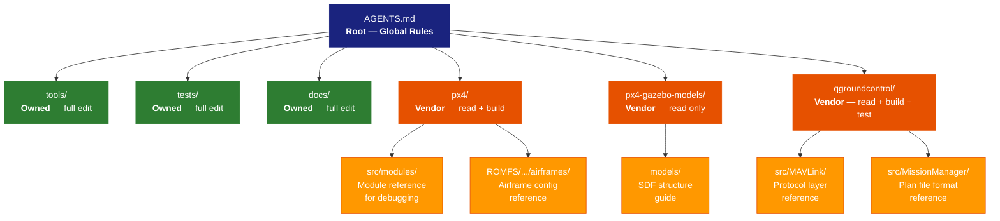

<!-- _class: lead -->

# PX4-Sim-Suite

## Mission-Based CI/CD for Custom UAV Development

---

# Agenda

1. **What is PX4-Sim-Suite?** — Purpose and goals
2. **Where We Fit** — UAV dev stack coverage
3. **Tech Stack** — Key technologies explained
4. **Architecture** — How components fit together
5. **DevContainer Design** — From clone to flying in one step
6. **Key Components** — The building blocks
7. **Workflow Modes** — CI, GUI, and Manual flying
8. **AI-Assisted Development** — AGENTS.md and context engineering
9. **Key Learnings & Patterns** — Insights from this stack
10. **Future Direction** — Where we're heading

---

<!-- _class: lead -->

# Part 1: What is PX4-Sim-Suite?

---

# The Problem This Repo Covers

**Developing custom UAVs is complex:**

- Custom aircraft geometries and propeller configurations
- Custom firmware modifications
- Ground station integration
- Testing before real-world flights
- Maintaining CI/CD across the entire stack

**Traditional approach:** Manual testing, fragmented tooling, no automation

---

# The Solution as Far as Open Source Can Easily Get

**PX4-Sim-Suite** is an example infrastructure repository that demonstrates:

- Simulated mission-based CI/CD for UAV development
- Automated flight scenario testing
- Full-stack integration (firmware → simulation → ground station)
- Portable development environment (WSL, Linux, Codespaces, CI)

---

# Core Philosophy

> **PX4 is treated as a vendor engine**

- We don't duplicate PX4's internal simulation system
- We **layer** testing, automation, and workflow management around it
- Clear ownership boundaries:
  - **PX4** = autopilot firmware (upstream)
  - **This repo** = orchestration, scenarios, CI, workflow

---

<!-- _class: lead -->

# Part 2: Where We Fit

## UAV Software Development & Testing Stack

---

<!--
  Coverage map of the full UAV development stack.
  Green  = covered by this repo
  Yellow = partially covered / basic
  Gray   = not covered (future or out of scope)
-->

# Full UAV Dev Stack — What We Cover



**Legend:** Green = covered | Yellow = partial | Gray = not covered

---


<!-- _class: lead -->

# Part 3: Tech Stack

---

# Core Technologies

| Component | Technology | Purpose |
|-----------|------------|---------|
| Autopilot | **PX4** | Flight controller firmware |
| Simulator | **Gazebo Harmonic** | Physics & sensor simulation |
| Ground Station | **QGroundControl** | Mission planning & telemetry |
| Communication | **MAVLink** | Drone ↔ GCS protocol |
| Scripting | **Python + pymavlink** | Automated flight control |

---

# What is PX4?

**PX4** is an open-source autopilot stack:

- Runs on real flight controllers (Pixhawk, etc.)
- Also runs as **SITL** (Software In The Loop) for simulation
- Handles:
  - Flight modes (manual, auto, hold, land)
  - Sensor fusion (GPS, IMU, barometer)
  - Motor mixing and control
  - Safety features (geofence, failsafe)

---

# What is Gazebo?

**Gazebo Harmonic** is a robotics simulator:

- Physics engine (dynamics, collisions)
- Sensor simulation (cameras, lidar, IMU)
- World/environment modeling
- Plugin architecture

**Key:** We use Gazebo Harmonic (the modern version), not Gazebo Classic

---

# What is MAVLink?

**MAVLink** = Micro Air Vehicle Link

- Binary protocol for drone communication
- Messages for: telemetry, commands, parameters
- Standard across many autopilots (PX4, ArduPilot)
- Python library: `pymavlink`

```python
# Example: Send takeoff command
mav.mav.command_long_send(
    target_system, target_component,
    MAV_CMD_NAV_TAKEOFF, 0,
    0, 0, 0, 0, 0, 0, altitude
)
```

---

# What is QGroundControl?

**QGroundControl (QGC)** is the ground control station:

- Mission planning (waypoints, geofences)
- Real-time telemetry display
- Vehicle configuration
- Manual flight control (virtual joystick)

Built with **Qt 6** — cross-platform C++ GUI framework

---

<!-- _class: lead -->

# Part 4: Architecture

---

# High-Level Architecture

```
┌─────────────────────────────────────────────────────────┐
│                    px4-sim-suite                         │
├─────────────────────────────────────────────────────────┤
│  tools/simtest     ← Single entry point CLI             │
│  tests/scenarios/  ← Automated flight missions          │
│  .devcontainer/    ← Portable dev environment           │
│  .github/workflows ← CI/CD pipeline                     │
├─────────────────────────────────────────────────────────┤
│              Git Submodules (Forks)                      │
│  px4/              ← PX4-Autopilot firmware             │
│  qgroundcontrol/   ← Ground Control Station             │
│  px4-gazebo-models/← Simulation models                  │
└─────────────────────────────────────────────────────────┘
```

---

# The Simulation Stack

```
┌──────────────────┐
│ QGroundControl   │  ← Human interface / mission planning
└────────┬─────────┘
         │ MAVLink (UDP 14550)
         ▼
┌──────────────────┐
│ PX4 SITL         │  ← Autopilot firmware (simulated)
└────────┬─────────┘
         │ Sensor/Actuator bridge
         ▼
┌──────────────────┐
│ Gazebo Harmonic  │  ← Physics simulation
└──────────────────┘
```

---

# Execution Flow

```
simtest build  →  Compile PX4 SITL firmware
      ↓
simtest run    →  Launch Gazebo + PX4 + scenario
      ↓
Scenario runs  →  MAVLink commands drive the flight
      ↓
simtest collect → Gather logs, reports, artifacts
```

---

<!-- _class: lead -->

# Part 5: DevContainer Design

## From Clone to Flying in One Step

---

# The Setup Problem

**PX4 development traditionally requires:**

- Ubuntu (specific version) with dozens of system packages
- Gazebo Harmonic (not Classic — easy to install the wrong one)
- Python 3.10+ with pymavlink, plotly, pyulog, etc.
- Qt 6 SDK (for QGroundControl)
- CMake, Ninja, ccache, Make
- Correct environment variables for all of the above

**On Windows?** Add WSL2, X11 forwarding, audio routing...

---

# Our Answer: DevContainers

**Two prerequisites on your Windows machine:**
1. WSL installed and running
2. Docker Desktop installed

**Then open the repo in VS Code:**



One click. VS Code detects the `devcontainer.json`, builds the container,
installs every dependency, and drops you into a ready-to-build environment.

No manual package installation. No version mismatches. No "works on my machine."

---

# What Docker Desktop Gives Us



Container image is ~2 GB — includes the full PX4 build toolchain,
Gazebo, Python environment, and Qt SDK.

---

# One-Click Container Launch



VS Code's Dev Containers extension handles the entire lifecycle:
build, start, attach, rebuild — all from the command palette.

---

# Inside the Container


VS Code reconnects to the workspace inside the container.
Terminal, file explorer, extensions — all running in the Linux environment.

---

# Two Container Variants, One Codebase

```
.devcontainer/
├── devcontainer.json          ← Headless (CI + CLI work)
└── wsl-gui/
    └── devcontainer.json      ← GUI (Gazebo + QGC windows)
```

**Same base image.** Same `postCreateCommand`. Same dependencies.

The GUI variant only adds **mounts** and **environment variables**.

---

# Headless Container

```json
{
  "name": "px4-sim-suite",
  "image": "mcr.microsoft.com/devcontainers/base:ubuntu-24.04",
  "postCreateCommand": "python3 tools/env_requirements.py install
                        && bash px4/Tools/setup/ubuntu.sh --no-nuttx"
}
```

- Builds PX4, runs scenarios, collects artifacts
- No display server needed — uses Xvfb when required
- Same config runs in GitHub Actions via `devcontainers/ci`

---

# GUI Container — What's Different

```json
{
  "name": "px4-sim-suite (WSL GUI)",
  "runArgs": ["--net=host"],
  "mounts": [
    "/tmp/.X11-unix  → /tmp/.X11-unix",
    "/mnt/wslg       → /mnt/wslg"
  ],
  "containerEnv": {
    "DISPLAY": ":0",
    "WAYLAND_DISPLAY": "wayland-0",
    "XDG_RUNTIME_DIR": "/mnt/wslg/runtime-dir",
    "PULSE_SERVER": "/mnt/wslg/PulseServer"
  }
}
```

Three additions: **host networking**, **display mounts**, **env vars**.

---

# How WSLg Makes This Work



WSLg provides `/tmp/.X11-unix` and `/mnt/wslg` — we just bind-mount them in.

GUI apps inside the container render as native Windows windows.

---

# The Full Experience: GUI from a Container



Gazebo 3D view, QGroundControl, Docker Desktop resource monitor,
and PX4 terminal output — all running from inside the container.

---

# The postCreateCommand Pipeline



1. **Submodules** — pull PX4, QGC, Gazebo models
2. **Env manifest** — install apt packages, pip packages, Qt SDK
3. **PX4 setup** — PX4's own dependency installer (skips NuttX/hardware)
4. **Done** — `simtest build` works immediately

---

# Environment Manifest — Single Source of Truth

```json
{
  "apt_packages": ["cmake", "ninja-build", "ccache", ...],
  "pip_packages": ["pymavlink", "plotly", "pyulog", ...],
  "commands_required": ["gz", "make", "cmake", "xvfb-run"],
  "qt": { "version": "6.10.1", "modules": ["qtcharts"] }
}
```

Used by:
- `postCreateCommand` (DevContainer setup)
- GitHub Actions CI
- `env_requirements.py check` (validation)

No duplicate dependency lists anywhere.

---

# Design Decision: Why Not a Custom Dockerfile?

| Approach | Pros | Cons |
|----------|------|------|
| **Custom Dockerfile** | Full control | Slow rebuilds, version drift |
| **Pre-built image** | Fast startup | Stale deps, hard to audit |
| **Base image + postCreate** | Always fresh, transparent | Longer first build |

We chose **base image + postCreateCommand** because:
- Dependencies are visible in version-controlled JSON
- Same install path for CI and local dev
- No Docker registry to maintain
- PX4's own setup script stays in sync with PX4 version

---

# Design Decision: SSH Passthrough

```json
"mounts": [
  "source=${localEnv:HOME}${localEnv:USERPROFILE}/.ssh,
   target=/home/vscode/.ssh, readonly, type=bind"
],
"remoteEnv": {
  "SSH_AUTH_SOCK": "${localEnv:SSH_AUTH_SOCK}"
}
```

- SSH keys bind-mounted **read-only** from the host
- SSH agent socket forwarded for passphrase-less git operations
- No keys copied into the container image
- `git push` to submodule forks works seamlessly

---

# CI Uses the Same Container

```yaml
# .github/workflows/simtest-build.yml
jobs:
  build:
    runs-on: ubuntu-latest
    steps:
      - uses: devcontainers/ci@v0.3
        with:
          runCmd: |
            ./tools/simtest build
            ./tools/simtest run
            ./tools/simtest collect
```

**The same `devcontainer.json`** that runs on your laptop
runs in GitHub Actions. No separate CI Dockerfile.

---

# What This Means for Onboarding

| Step | Traditional | With DevContainers |
|------|------------|-------------------|
| 1 | Install Ubuntu or VM | Install Docker Desktop |
| 2 | Install 20+ packages | `git clone --recursive` |
| 3 | Install Gazebo (correct version) | Open in VS Code |
| 4 | Install Python deps | "Reopen in Container" |
| 5 | Install Qt SDK | *done* |
| 6 | Configure env vars | |
| 7 | Debug why Gazebo won't start | |
| 8 | *maybe* ready to build | |

**From clone to `simtest build` — one command, zero configuration.**

---

<!-- _class: lead -->

# Part 6: Key Components

---

# Repository Structure

```
px4-sim-suite/
├── tools/                    # Our orchestration layer
│   ├── simtest               # Main CLI entry point
│   ├── run_sim_with_gui.sh   # Visual debugging
│   ├── run_sim_with_qgc.sh   # Manual flying
│   └── environment_manifest.json
├── tests/
│   └── scenarios/
│       └── takeoff_land.py   # Automated flight test
├── .devcontainer/            # Dev environment configs
└── .github/workflows/        # CI/CD
```

---

# The `simtest` CLI

**Single entry point** for all operations:

```bash
simtest build              # Compile PX4 SITL
simtest run                # Run headless simulation
simtest collect            # Gather artifacts
simtest all                # Full pipeline

simtest qgc build          # Build QGroundControl
simtest qgc test           # Test QGC
simtest qgc autoplan       # Run mission plan
```

---

# Flight Scenarios

Python scripts that drive automated flights:

```python
# tests/scenarios/takeoff_land.py

# 1. Connect via MAVLink
# 2. Wait for vehicle ready
# 3. Arm the vehicle
# 4. Command takeoff to 10m
# 5. Hold position for 10 seconds
# 6. Command landing
# 7. Verify disarm
# 8. Output results
```

**Extensible:** Add new scenarios under `tests/scenarios/`

---

# Artifacts

Deterministic output locations for CI:

```
artifacts/
├── takeoff_land.log         # Scenario transcript
├── takeoff_land_summary.json # Metrics (hover alt, land time)
├── flight_report.html       # Interactive Plotly charts
└── *.ulg                    # Raw PX4 flight logs
```

---

# Reading the Flight Report


Generated from ULog data — altitude profile, quick metrics, flight duration.

---

<!-- _class: lead -->

# Part 7: Workflow Modes

---

# Three Execution Modes

| Mode | Script | Display | User Input | Purpose |
|------|--------|---------|------------|---------|
| **CI/CD** | `simtest run` | Headless | None | Automated testing |
| **Visual Debug** | `run_sim_with_gui.sh` | Gazebo GUI | Optional | Watch scenarios run |
| **Manual Flying** | `run_sim_with_qgc.sh` | QGC + Gazebo | Required | Test manually |

---

# CI/CD Mode

```bash
simtest all
```

- Runs entirely headless (Xvfb)
- No user interaction
- Produces artifacts for validation
- Used in GitHub Actions

---

# Visual Debug Mode

```bash
./tools/run_sim_with_gui.sh
```

- Opens Gazebo window
- Watch the drone fly the scenario
- Great for debugging physics/models
- Requires WSL GUI or native Linux display

---

# Manual Flying Mode

```bash
./tools/run_sim_with_qgc.sh
```

- Opens QGroundControl + Gazebo
- Fly manually with virtual joystick
- Create and test mission plans
- Full interactive experience

---

<!-- _class: lead -->

# Part 8: AI-Assisted Development

## AGENTS.md and Context Engineering

---

# The Problem with Global AI Instructions

**.copilot-instructions / .github/copilot-instructions.md:**

- Single flat file at the repo root
- Same rules apply everywhere, regardless of context
- A drone firmware directory needs different rules than a test script directory
- No way to say "you can edit here, but not there"

**Result:** Generic instructions that are either too permissive or too restrictive

---

# AGENTS.md — Scoped by Directory

```
px4-sim-suite/
├── AGENTS.md                       ← Repo-wide rules, authority model
├── docs/
│   └── AGENTS.md                   ← Doc navigation, stage planning
├── tools/
│   └── AGENTS.md                   ← Script reference, CLI usage
├── tests/
│   └── AGENTS.md                   ← Test contribution rules
│
│   ── Submodules (forked vendor repos) ──
│
├── px4/
│   ├── AGENTS.md                   ← Read + build only
│   ├── src/modules/
│   │   └── AGENTS.md               ← Module reference for debugging
│   └── ROMFS/.../airframes/
│       └── AGENTS.md               ← Airframe config reference
├── px4-gazebo-models/
│   ├── AGENTS.md                   ← Read only, reference models
│   └── models/
│       └── AGENTS.md               ← SDF model structure guide
└── qgroundcontrol/
    ├── AGENTS.md                   ← Read + build + test
    └── src/
        ├── MAVLink/
        │   └── AGENTS.md           ← Protocol layer reference
        └── MissionManager/
            └── AGENTS.md           ← Plan file format reference
```

Each deeper file **inherits** its parent's rules and **narrows** the context further.

---

# How It Works: Context Inheritance



---

# What Each Level Provides

| Level | Purpose | Permissions |
|-------|---------|-------------|
| **Root** | Global authority model | Defines the rules |
| **tools/** | Script docs, CLI reference | Full edit |
| **tests/** | Test patterns, conventions | Full edit |
| **docs/** | Navigation, stage planning | Full edit |
| **px4/** | Firmware build context | Read + build |
| ↳ **src/modules/** | Flight module reference | Read — for debugging |
| ↳ **airframes/** | Vehicle config reference | Read — for tuning |
| **px4-gazebo-models/** | Simulation model reference | Read only |
| ↳ **models/** | SDF structure guide | Read — for model work |
| **qgroundcontrol/** | Ground station context | Read + build + test |
| ↳ **src/MAVLink/** | Protocol layer reference | Read — for integration |
| ↳ **src/MissionManager/** | Plan format reference | Read — for scenarios |

Rules **narrow** as you go deeper — never widen.

---

# Why Not .copilot-instructions?

| | `.copilot-instructions` | `AGENTS.md` |
|-|------------------------|-------------|
| **Scope** | Repo-wide only | Per-directory |
| **Inheritance** | None | Parent context flows down |
| **Submodule awareness** | No | Yes — different rules per submodule |
| **Vendor vs. owned** | Can't distinguish | Explicit per directory |
| **Tool support** | GitHub Copilot only | Claude, Codex, any AGENTS.md-aware tool |
| **Visibility** | Hidden dot-file | Visible, reviewable markdown |

---

# Real Example: Same Repo, Different Rules

**Agent working in `tools/`** — sees:
> "Full edit access. Here are the scripts, here are the workflows.
> Modify freely, follow patterns."

**Agent working in `px4/`** — sees:
> "This is vendor code. You may read and build.
> Do not commit. Propose changes via patch files."

**Agent working in `qgroundcontrol/`** — sees:
> "This is vendor code. You may build and run tests.
> Do not modify source. Propose changes via patch files."

The agent's behavior **changes based on where it is working** —
without any prompt engineering from the user.

---

<!-- _class: lead -->

# Part 9: Key Learnings & Patterns

---

# Pattern 1: Mission-Based Testing

**Insight:** Test scenarios are first-class code

- Not just "does it compile?"
- "Does it actually fly the mission correctly?"

```python
# Verify: Did we reach target altitude?
# Verify: Did we hold position?
# Verify: Did we land safely?
# Verify: Did motors disarm?
```

---

# Pattern 2: Vendor vs. Orchestration

**Insight:** Separate what you control from what you consume

| Layer | Ownership | Repo |
|-------|-----------|------|
| PX4 firmware | Upstream (PX4 project) | Submodule |
| QGroundControl | Upstream (MAVLink project) | Submodule |
| Gazebo models | Upstream (PX4 project) | Submodule |
| Test scenarios | **Us** | This repo |
| CI/CD pipeline | **Us** | This repo |
| Orchestration | **Us** | This repo |

---

# Pattern 3: Artifact Contracts

**Insight:** Define clear, predictable outputs

```
artifacts/
├── {scenario}_summary.json    # Always JSON
├── {scenario}.log             # Always text log
├── flight_report.html         # Always HTML
└── *.ulg                      # Always ULog format
```

CI can "blindly" upload these — no path guessing

---

# Pattern 4: Single Entry Point

**Insight:** One CLI to rule them all

Before:
```bash
cd px4 && make px4_sitl gz_x500 &
sleep 30
python3 tests/scenarios/takeoff_land.py
killall px4 gz
# (forgot to collect logs?)
```

After:
```bash
simtest all
```

---

# Pattern 5: Environment as Code

**Insight:** Dependencies belong in version control

- `environment_manifest.json` defines everything
- `env_requirements.py` installs/validates
- Same deps in: DevContainer, CI, local dev
- No "works on my machine" problems

---

<!-- _class: lead -->

# Part 10: Future Direction

---

# MVP Stages — Completed

| Stage | Description | Status |
|-------|-------------|--------|
| 0 | Charter & Contracts | ✅ |
| 1 | Single Entry Point (`simtest`) | ✅ |
| 2 | Environment Normalization | ✅ |
| 3 | PX4 SITL Build | ✅ |
| 4 | Headless Gazebo | ✅ |
| 5 | Flight Scenarios | ✅ |
| 6 | Artifact Collection | ✅ |
| 7 | GitHub Actions CI | ✅ |
| 8 | GUI Support | ✅ |

---

# Potential Future Work

- **Multi-vehicle simulation** — Swarm testing
- **ROS 2 integration** — Robot Operating System
- **Hardware-in-the-loop (HITL)** — Real hardware testing
- **Expanded scenario library** — More test cases
- **Performance benchmarking** — Timing validation
- **Custom aircraft models** — Novel configurations

---

# How to Extend

**Add a new scenario:**
1. Create `tests/scenarios/my_scenario.py`
2. Follow MAVLink patterns from `takeoff_land.py`
3. Output to `artifacts/` directory
4. Update CI if needed

**Add a custom model:**
1. Create SDF in `px4-gazebo-models/`
2. Add airframe to PX4
3. Reference in scenario

---

<!-- _class: lead -->

# Summary

---

# Key Takeaways

1. **Mission-based CI/CD** validates flight behavior, not just builds
2. **Clear ownership boundaries** between vendor and orchestration
3. **Portable environments** via DevContainers — one click to start
4. **Three workflow modes** for different needs (CI, visual, manual)
5. **Deterministic artifacts** enable automated validation
6. **Single entry point** simplifies complex operations
7. **AGENTS.md** enables context-aware AI assistance

---

# Resources

- **Main README:** `README.md`
- **MVP Charter:** `docs/project_charters/mvp_development_stages_context.md`
- **Agent Guidelines:** `AGENTS.md`
- **PX4 Docs:** https://docs.px4.io/
- **QGC Docs:** https://docs.qgroundcontrol.com/
- **Gazebo Docs:** https://gazebosim.org/

---

<!-- _class: lead -->

# Questions?

---

# Appendix: Quick Reference

```bash
# Build
simtest build

# Run headless test
simtest run

# Full pipeline
simtest all

# Visual debugging
./tools/run_sim_with_gui.sh

# Manual flying
./tools/run_sim_with_qgc.sh

# Build QGC
simtest qgc build
```