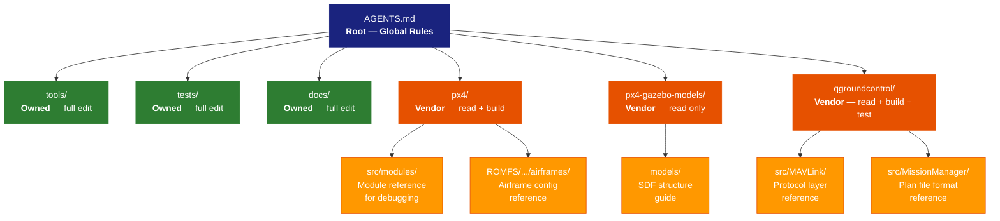

<!-- _class: lead -->

# AGENTS.md

## Context-Aware AI Guidance at Every Level

---

# The Problem with Global AI Instructions

**.copilot-instructions / .github/copilot-instructions.md:**

- Single flat file at the repo root
- Same rules apply everywhere, regardless of context
- A drone firmware directory needs different rules than a test script directory
- No way to say "you can edit here, but not there"

**Result:** Generic instructions that are either too permissive or too restrictive

---

# AGENTS.md — Scoped by Directory

```
px4-sim-suite/
├── AGENTS.md                       ← Repo-wide rules, authority model
├── docs/
│   └── AGENTS.md                   ← Doc navigation, stage planning
├── tools/
│   └── AGENTS.md                   ← Script reference, CLI usage
├── tests/
│   └── AGENTS.md                   ← Test contribution rules
│
│   ── Submodules (forked vendor repos) ──
│
├── px4/
│   ├── AGENTS.md                   ← Read + build only
│   ├── src/modules/
│   │   └── AGENTS.md               ← Module reference for debugging
│   └── ROMFS/.../airframes/
│       └── AGENTS.md               ← Airframe config reference
├── px4-gazebo-models/
│   ├── AGENTS.md                   ← Read only, reference models
│   └── models/
│       └── AGENTS.md               ← SDF model structure guide
└── qgroundcontrol/
    ├── AGENTS.md                   ← Read + build + test
    └── src/
        ├── MAVLink/
        │   └── AGENTS.md           ← Protocol layer reference
        └── MissionManager/
            └── AGENTS.md           ← Plan file format reference
```

Each deeper file **inherits** its parent's rules and **narrows** the context further.

---

# How It Works: Context Inheritance



---

# What Each Level Provides

| Level | Purpose | Permissions |
|-------|---------|-------------|
| **Root** | Global authority model | Defines the rules |
| **tools/** | Script docs, CLI reference | Full edit |
| **tests/** | Test patterns, conventions | Full edit |
| **docs/** | Navigation, stage planning | Full edit |
| **px4/** | Firmware build context | Read + build |
| ↳ **src/modules/** | Flight module reference | Read — for debugging |
| ↳ **airframes/** | Vehicle config reference | Read — for tuning |
| **px4-gazebo-models/** | Simulation model reference | Read only |
| ↳ **models/** | SDF structure guide | Read — for model work |
| **qgroundcontrol/** | Ground station context | Read + build + test |
| ↳ **src/MAVLink/** | Protocol layer reference | Read — for integration |
| ↳ **src/MissionManager/** | Plan format reference | Read — for scenarios |

Rules **narrow** as you go deeper — never widen.

---

# Why Not .copilot-instructions?

| | `.copilot-instructions` | `AGENTS.md` |
|-|------------------------|-------------|
| **Scope** | Repo-wide only | Per-directory |
| **Inheritance** | None | Parent context flows down |
| **Submodule awareness** | No | Yes — different rules per submodule |
| **Vendor vs. owned** | Can't distinguish | Explicit per directory |
| **Tool support** | GitHub Copilot only | Claude, Codex, any AGENTS.md-aware tool |
| **Visibility** | Hidden dot-file | Visible, reviewable markdown |

---

# Real Example: Same Repo, Different Rules

**Agent working in `tools/`** — sees:
> "Full edit access. Here are the scripts, here are the workflows.
> Modify freely, follow patterns."

**Agent working in `px4/`** — sees:
> "This is vendor code. You may read and build.
> Do not commit. Propose changes via patch files."

**Agent working in `qgroundcontrol/`** — sees:
> "This is vendor code. You may build and run tests.
> Do not modify source. Propose changes via patch files."

The agent's behavior **changes based on where it is working** —
without any prompt engineering from the user.
