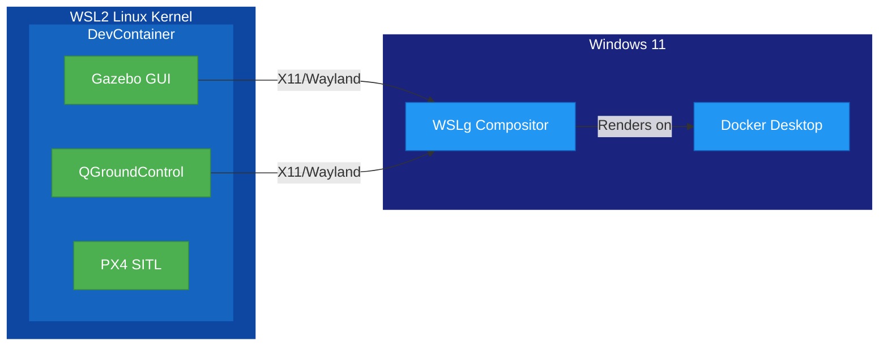
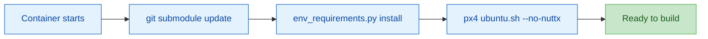

<!-- _class: lead -->

# DevContainer Design

## From Clone to Flying in One Step

---

# The Setup Problem

**PX4 development traditionally requires:**

- Ubuntu (specific version) with dozens of system packages
- Gazebo Harmonic (not Classic — easy to install the wrong one)
- Python 3.10+ with pymavlink, plotly, pyulog, etc.
- Qt 6 SDK (for QGroundControl)
- CMake, Ninja, ccache, Make
- Correct environment variables for all of the above

**On Windows?** Add WSL2, X11 forwarding, audio routing...

---

# Our Answer: DevContainers

**Two prerequisites on your Windows machine:**
1. WSL installed and running
2. Docker Desktop installed

**Then open the repo in VS Code:**


One click. VS Code detects the `devcontainer.json`, builds the container,
installs every dependency, and drops you into a ready-to-build environment.

No manual package installation. No version mismatches. No "works on my machine."

---

# What Docker Desktop Gives Us


Container image is ~2 GB — includes the full PX4 build toolchain,
Gazebo, Python environment, and Qt SDK.

---

# One-Click Container Launch


VS Code's Dev Containers extension handles the entire lifecycle:
build, start, attach, rebuild — all from the command palette.

---

# Inside the Container


VS Code reconnects to the workspace inside the container.
Terminal, file explorer, extensions — all running in the Linux environment.

---

# Two Container Variants, One Codebase

```
.devcontainer/
├── devcontainer.json          ← Headless (CI + CLI work)
└── wsl-gui/
    └── devcontainer.json      ← GUI (Gazebo + QGC windows)
```

**Same base image.** Same `postCreateCommand`. Same dependencies.

The GUI variant only adds **mounts** and **environment variables**.

---

# Headless Container

```json
{
  "name": "px4-sim-suite",
  "image": "mcr.microsoft.com/devcontainers/base:ubuntu-24.04",
  "postCreateCommand": "python3 tools/env_requirements.py install
                        && bash px4/Tools/setup/ubuntu.sh --no-nuttx"
}
```

- Builds PX4, runs scenarios, collects artifacts
- No display server needed — uses Xvfb when required
- Same config runs in GitHub Actions via `devcontainers/ci`

---

# GUI Container — What's Different

```json
{
  "name": "px4-sim-suite (WSL GUI)",
  "runArgs": ["--net=host"],
  "mounts": [
    "/tmp/.X11-unix  → /tmp/.X11-unix",
    "/mnt/wslg       → /mnt/wslg"
  ],
  "containerEnv": {
    "DISPLAY": ":0",
    "WAYLAND_DISPLAY": "wayland-0",
    "XDG_RUNTIME_DIR": "/mnt/wslg/runtime-dir",
    "PULSE_SERVER": "/mnt/wslg/PulseServer"
  }
}
```

Three additions: **host networking**, **display mounts**, **env vars**.

---

# How WSLg Makes This Work



WSLg provides `/tmp/.X11-unix` and `/mnt/wslg` — we just bind-mount them in.

GUI apps inside the container render as native Windows windows.

---

# The Full Experience: GUI from a Container


Gazebo 3D view, QGroundControl, Docker Desktop resource monitor,
and PX4 terminal output — all running from inside the container.

---

# The postCreateCommand Pipeline



1. **Submodules** — pull PX4, QGC, Gazebo models
2. **Env manifest** — install apt packages, pip packages, Qt SDK
3. **PX4 setup** — PX4's own dependency installer (skips NuttX/hardware)
4. **Done** — `simtest build` works immediately

---

# Environment Manifest — Single Source of Truth

```json
{
  "apt_packages": ["cmake", "ninja-build", "ccache", ...],
  "pip_packages": ["pymavlink", "plotly", "pyulog", ...],
  "commands_required": ["gz", "make", "cmake", "xvfb-run"],
  "qt": { "version": "6.10.1", "modules": ["qtcharts"] }
}
```

Used by:
- `postCreateCommand` (DevContainer setup)
- GitHub Actions CI
- `env_requirements.py check` (validation)

No duplicate dependency lists anywhere.

---

# Design Decision: Why Not a Custom Dockerfile?

| Approach | Pros | Cons |
|----------|------|------|
| **Custom Dockerfile** | Full control | Slow rebuilds, version drift |
| **Pre-built image** | Fast startup | Stale deps, hard to audit |
| **Base image + postCreate** | Always fresh, transparent | Longer first build |

We chose **base image + postCreateCommand** because:
- Dependencies are visible in version-controlled JSON
- Same install path for CI and local dev
- No Docker registry to maintain
- PX4's own setup script stays in sync with PX4 version

---

# Design Decision: SSH Passthrough

```json
"mounts": [
  "source=${localEnv:HOME}${localEnv:USERPROFILE}/.ssh,
   target=/home/vscode/.ssh, readonly, type=bind"
],
"remoteEnv": {
  "SSH_AUTH_SOCK": "${localEnv:SSH_AUTH_SOCK}"
}
```

- SSH keys bind-mounted **read-only** from the host
- SSH agent socket forwarded for passphrase-less git operations
- No keys copied into the container image
- `git push` to submodule forks works seamlessly

---

# CI Uses the Same Container

```yaml
# .github/workflows/simtest-build.yml
jobs:
  build:
    runs-on: ubuntu-latest
    steps:
      - uses: devcontainers/ci@v0.3
        with:
          runCmd: |
            ./tools/simtest build
            ./tools/simtest run
            ./tools/simtest collect
```

**The same `devcontainer.json`** that runs on your laptop
runs in GitHub Actions. No separate CI Dockerfile.

---

# What This Means for Onboarding

| Step | Traditional | With DevContainers |
|------|------------|-------------------|
| 1 | Install Ubuntu or VM | Install Docker Desktop |
| 2 | Install 20+ packages | `git clone --recursive` |
| 3 | Install Gazebo (correct version) | Open in VS Code |
| 4 | Install Python deps | "Reopen in Container" |
| 5 | Install Qt SDK | *done* |
| 6 | Configure env vars | |
| 7 | Debug why Gazebo won't start | |
| 8 | *maybe* ready to build | |

**From clone to `simtest build` — one command, zero configuration.**
