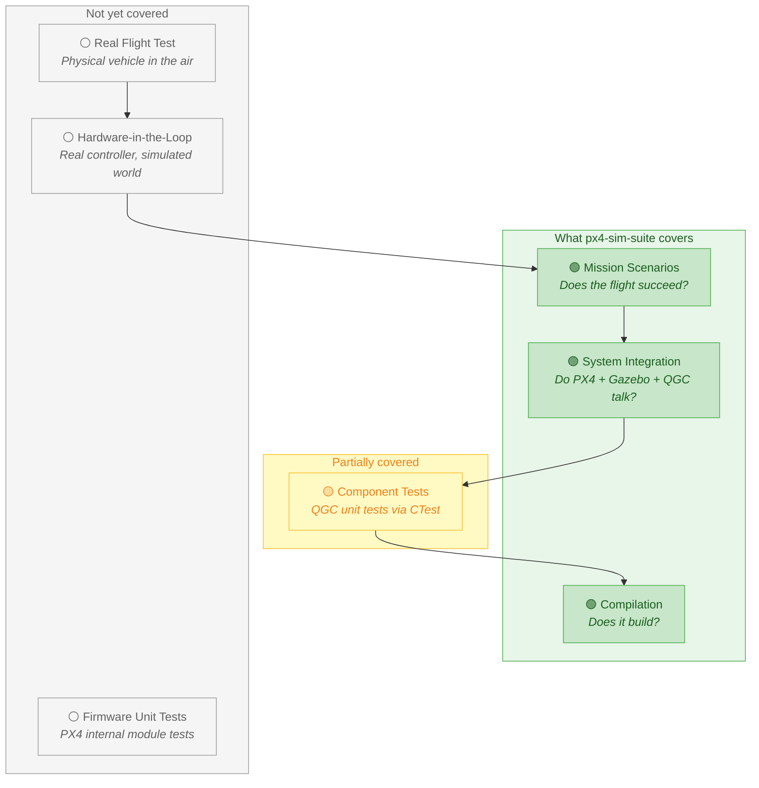

<!-- _class: lead -->

# Where px4-sim-suite Fits

## UAV Software Development & Testing Stack Coverage

---

<!--
  Coverage map of the full UAV development stack.
  Green  = covered by this repo
  Yellow = partially covered / basic
  Gray   = not covered (future or out of scope)
-->

# Full UAV Dev Stack — What We Cover

```mermaid
flowchart TD
    subgraph fw ["Autopilot Firmware"]
        FW_COMP["Compilation"]
        FW_UNIT["Unit Tests"]
        FW_FUNC["Functional Self Check"]
        FW_BIN["Hardware Binary Products"]
    end

    subgraph gcs ["Ground Station"]
        GCS_COMP["Source Build"]
        GCS_UNIT["Unit Tests"]
        GCS_FUNC["Handshake Validation"]
        GCS_BIN["Executable (Appimage)"]
    end

    subgraph sim ["Simulation & Models"]
        SIM_PHY["Physics Sim"]
        SIM_MOD["Aircraft Models"]
        SIM_ADV["Aero & Stability Analysis"]
        SIM_VAL["Control Verification "]
    end

    subgraph test ["Integration & Scenarios"]
        TEST_SCN["Scripted Missions"]
        TEST_ART["Artifact Collection"]
        TEST_RPT["Flight Reports"]
        TEST_MUL["Safety of Flight"]
    end

    subgraph ci ["CI/CD & Environment"]
        CI_DEV["Container Definition"]
        CI_GHA["Test Runners"]
        CI_HEAD["Headless Execution"]
        CI_ENV["Interactive Execution"]
    end

    subgraph hw ["Hardware Integration"]
        HW_HITL["Hardware-in-the-Loop"]
        HW_FLASH["Firmware Flashing"]
        HW_RADIO["Radio Link Testing"]
        HW_SENS["Sensor Calibration"]
    end

    %% Covered - green
    style FW_COMP fill:#c8e6c9,stroke:#4caf50,color:#1b5e20
    style GCS_COMP fill:#c8e6c9,stroke:#4caf50,color:#1b5e20
    style GCS_UNIT fill:#c8e6c9,stroke:#4caf50,color:#1b5e20
    style SIM_PHY fill:#c8e6c9,stroke:#4caf50,color:#1b5e20
    style SIM_MOD fill:#c8e6c9,stroke:#4caf50,color:#1b5e20
    style TEST_SCN fill:#c8e6c9,stroke:#4caf50,color:#1b5e20
    style TEST_ART fill:#c8e6c9,stroke:#4caf50,color:#1b5e20
    style TEST_RPT fill:#c8e6c9,stroke:#4caf50,color:#1b5e20
    style CI_GHA fill:#c8e6c9,stroke:#4caf50,color:#1b5e20
    style CI_DEV fill:#c8e6c9,stroke:#4caf50,color:#1b5e20
    style CI_ENV fill:#c8e6c9,stroke:#4caf50,color:#1b5e20
    style CI_HEAD fill:#c8e6c9,stroke:#4caf50,color:#1b5e20

    %% Partial - yellow
    style GCS_FUNC fill:#fff9c4,stroke:#fbc02d,color:#f57f17
    style GCS_BIN fill:#fff9c4,stroke:#fbc02d,color:#f57f17
    style SIM_VAL fill:#fff9c4,stroke:#fbc02d,color:#f57f17
    style TEST_MUL fill:#fff9c4,stroke:#fbc02d,color:#f57f17

    %% Not covered - gray
    style FW_UNIT fill:#f5f5f5,stroke:#bdbdbd,color:#9e9e9e
    style FW_FUNC fill:#f5f5f5,stroke:#bdbdbd,color:#9e9e9e
    style FW_BIN fill:#f5f5f5,stroke:#bdbdbd,color:#9e9e9e
    style SIM_ADV fill:#f5f5f5,stroke:#bdbdbd,color:#9e9e9e
    style HW_HITL fill:#f5f5f5,stroke:#bdbdbd,color:#9e9e9e
    style HW_FLASH fill:#f5f5f5,stroke:#bdbdbd,color:#9e9e9e
    style HW_RADIO fill:#f5f5f5,stroke:#bdbdbd,color:#9e9e9e
    style HW_SENS fill:#f5f5f5,stroke:#bdbdbd,color:#9e9e9e

    %% Subgraph styles
    style fw fill:#e8f5e9,stroke:#4caf50
    style gcs fill:#e8f5e9,stroke:#4caf50
    style sim fill:#e8f5e9,stroke:#4caf50
    style test fill:#e8f5e9,stroke:#4caf50
    style ci fill:#e8f5e9,stroke:#4caf50
    style hw fill:#fafafa,stroke:#bdbdbd
```

**Legend:** Green = covered | Yellow = partial | Gray = not covered

---

# Coverage Summary

| Domain | Coverage | What We Do | What We Don't |
|--------|----------|------------|---------------|
| **Autopilot Firmware** | Partial | SITL compilation | Unit tests, hardware binaries |
| **Ground Station** | Strong | Build, unit tests, handshake | UI testing, multi-platform packaging |
| **Simulation** | Strong | Gazebo physics, aircraft models | Aero analysis, wind/weather |
| **Integration Testing** | Strong | Scenarios, artifacts, reports | Multi-vehicle, failure injection |
| **CI/CD** | Full | GitHub Actions, DevContainers, headless | — |
| **Hardware** | None | — | HITL, flashing, radio, sensors |

**Focus:** Simulated mission-level verification, not hardware deployment

---

# The Testing Pyramid — UAV Edition

> We test from the **middle out** — compilation through mission-level — leaving hardware integration for future stages.
